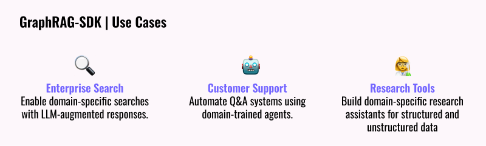

# GraphRAG 
[](https://hub.docker.com/r/falkordb/falkordb/)
[](https://pypi.org/project/graphrag_sdk/)
[](https://discord.gg/6M4QwDXn2w)
[](CODE_OF_CONDUCT.md)

<p align="center">
  
</p>

### Build fast and accurate GenAI apps with GraphRAG SDK at scale

Simplify the development of your next GenAI application with GraphRAG-SDK, a specialized toolkit for building Graph Retrieval-Augmented Generation (GraphRAG) systems. It integrates knowledge graphs, ontology management, and state-of-the-art LLMs to deliver accurate, efficient, and customizable RAG workflows.

# GraphRAG Setup
### Database Setup

[](https://app.falkordb.cloud)

Or use on premise with Docker:

```sh
docker run -p 6379:6379 -p 3000:3000 -it --rm  -v ./data:/data falkordb/falkordb:latest
```

### Dependencies:
```sh
pip install graphrag_sdk
```

### Configure Credentials. See [.env](.env.template) for examples.

* [LiteLLM](https://docs.litellm.ai): A framework supporting inference of large language models, allowing flexibility in deployment and use cases.  
  To choose vendor use the prefix "specific_vendor/your_model", for example "openai/gpt-4.1".
* [OpenAI](https://openai.com/index/openai-api) Recommended model:`gpt-4.1`
* [Google](https://makersuite.google.com/app/apikey) Recommended model:`gemini-2.0-flash`
* [Azure-OpenAI](https://ai.azure.com) Recommended model:`gpt-4.1`
* [Ollama](https://ollama.com/) Available only to the Q&A step. Recommended models: `llama3`. Ollama models are suitable for the Q&A step only (after the knowledge graph (KG) created).


# How to use
[](https://lightning.ai/muhammadqadora/studios/build-fast-accurate-genai-apps-advanced-rag-with-falkordb)
[](https://colab.research.google.com/github/FalkorDB/GraphRAG-SDK/blob/main/examples/movies/demo-movies.ipynb)

### Step 1: Creating Ontologies
Automate ontology creation from unstructured data or define it manually - See [example](https://github.com/falkordb/GraphRAG-SDK/blob/main/examples/trip/demo_orchestrator_trip.ipynb)

```python
from dotenv import load_dotenv
import json
from graphrag_sdk.source import URL
from graphrag_sdk import KnowledgeGraph, Ontology
from graphrag_sdk.models.litellm import LiteModel
from graphrag_sdk.model_config import KnowledgeGraphModelConfig
load_dotenv()

# Import Data
urls = ["https://www.rottentomatoes.com/m/side_by_side_2012",
"https://www.rottentomatoes.com/m/matrix",
"https://www.rottentomatoes.com/m/matrix_revolutions",
"https://www.rottentomatoes.com/m/matrix_reloaded",
"https://www.rottentomatoes.com/m/speed_1994",
"https://www.rottentomatoes.com/m/john_wick_chapter_4"]

sources = [URL(url) for url in urls]

# Model - vendor: openai, model: gpt-4.1 -> openai/gpt-4.1
model = LiteModel(model_name="openai/gpt-4.1")

# Ontology Auto-Detection
ontology = Ontology.from_sources(
    sources=sources,
    model=model,
)
# Save the ontology to the disk as a json file.
with open("ontology.json", "w", encoding="utf-8") as file:
    file.write(json.dumps(ontology.to_json(), indent=2))
```

### Step 2: Creating a knowledge graph agent
Build, query, and manage knowledge graphs optimized for retrieval and augmentation tasks. 
Leverages FalkorDB for high-performance graph querying and multi-tenancy.

```python
# After approving the ontology, load it from disk.
ontology_file = "ontology.json"
with open(ontology_file, "r", encoding="utf-8") as file:
    ontology = Ontology.from_json(json.loads(file.read()))

kg = KnowledgeGraph(
    name="kg_name",
    model_config=KnowledgeGraphModelConfig.with_model(model),
    ontology=ontology,
    host="127.0.0.1",
    port=6379,
    # username=falkor_username, # optional
    # password=falkor_password  # optional
)

kg.process_sources(sources)
```

### Step 3: Query your Graph RAG

At this point, you have a Knowledge Graph that can be queried using this SDK. Use the method `chat_session` for start a conversation.

```python
# Conversation
chat = kg.chat_session()
response = chat.send_message("Who is the director of the movie The Matrix?")
print(response)
response = chat.send_message("How this director connected to Keanu Reeves?")
print(response)
```

## Next Steps
With these 3 steps now completed, you're ready to interact and query your knowledge graph.  Here are suggestions for use cases:
<p align="left">
  
</p>

**Need help with your use case? let's [talk](https://www.falkordb.com/get-demo/)**

<br />

# AI Agents with GraphRAG

### Orchestrator
The GraphRAG-SDK supports Knowledge Graph-based agents. Each agent is an expert in his domain, and the orchestrator orchestrates the agents.

Check out the example:

[](https://colab.research.google.com/github/FalkorDB/GraphRAG-SDK/blob/main/examples/trip/demo_orchestrator_trip.ipynb)


### Agents

See the [Step 1](#how-to-use) section to understand how to create Knowledge Graph objects for the agents.

```python
# Define the model
model = LiteModel(model_name="openai/gpt-4.1")

# Create the Knowledge Graph from the predefined ontology.
# In this example, we will use the restaurants agent and the attractions agent.
restaurants_kg = KnowledgeGraph(
    name="restaurants",
    ontology=restaurants_ontology,
    model_config=KnowledgeGraphModelConfig.with_model(model),
    host="127.0.0.1",
    port=6379,
    # username=falkor_username, # optional
    # password=falkor_password  # optional
)
attractions_kg = KnowledgeGraph(
    name="attractions",
    ontology=attractions_ontology,
    model_config=KnowledgeGraphModelConfig.with_model(model),
    host="127.0.0.1",
    port=6379,
    # username=falkor_username, # optional
    # password=falkor_password  # optional
)


# The following agent is specialized in finding restaurants.
restaurants_agent = KGAgent(
    agent_id="restaurants_agent",
    kg=restaurants_kg,
    introduction="I'm a restaurant agent, specialized in finding the best restaurants for you.",
)

# The following agent is specialized in finding tourist attractions.
attractions_agent = KGAgent(
    agent_id="attractions_agent",
    kg=attractions_kg,
    introduction="I'm an attractions agent, specialized in finding the best tourist attractions for you.",
)
```

### Orchestrator - Multi-Agent System

The orchestrator manages the usage of agents and handles questioning.

```python
# Initialize the orchestrator while giving it the backstory.
orchestrator = Orchestrator(
    model,
    backstory="You are a trip planner, and you want to provide the best possible itinerary for your clients.",
)

# Register the agents that we created above.
orchestrator.register_agent(restaurants_agent)
orchestrator.register_agent(attractions_agent)

# Query the orchestrator.
runner = orchestrator.ask("Create a two-day itinerary for a trip to Rome. Please don't ask me any questions; just provide the best itinerary you can.")
print(runner.output)

```
## Community

Have questions or feedback? Reach out via:
- [GitHub Issues](https://github.com/FalkorDB/GraphRAG-SDK/issues)
- Join our [Discord](https://discord.com/invite/6M4QwDXn2w)

⭐️ If you find this repository helpful, please consider giving it a star!

## Additional Enhancement: Configuring your prompts
When creating your Knowledge Graph (KG) agent, you can customize the prompts to tailor its behavior.

💡 This step is optional but can enhance functionality.

There are five types of prompts:

1. **`cypher_system_instruction`**  
   - System instructions for the Cypher generation step.  
   - **Note:** Ensure your prompt includes `{ontology}`.

2. **`qa_system_instruction`**  
   - System instructions for the Q&A step.

3. **`cypher_gen_prompt`**  
   - The prompt used during the Cypher generation step.  
   - **Note:** Include `{question}` in your prompt.

4. **`cypher_gen_prompt_history`**  
   - The prompt for Cypher generation when history needs to be considered.  
   - **Note:** Include `{question}` and `{last_answer}` in your prompt.

5. **`qa_prompt`**  
   - The prompt used during the Q&A step.  
   - **Note:** Include `{question}`, `{context}`, and `{cypher}` in your prompt.

Here’s an example configuration:

```python
kg = KnowledgeGraph(
    name="kg_name",
    model_config=KnowledgeGraphModelConfig.with_model(model),
    ontology=ontology,
    cypher_system_instruction=cypher_system_instruction,
    qa_system_instruction=qa_system_instruction,
    cypher_gen_prompt=cypher_gen_prompt,
    cypher_gen_prompt_history=cypher_gen_prompt_history,
    qa_prompt=qa_prompt
    host="127.0.0.1",
    port=6379,
    # username=falkor_username, # optional
    # password=falkor_password  # optional
)
```


## FAQ
**Which databases are supported?**

GraphRAG-SDK is optimized for FalkorDB. Other backends may require adapters.

**How scalable is the SDK?**

GraphRAG-SDK is designed for multi-tenancy and large-scale applications. Performance depends on FalkorDB deployment configuration.

**How does this SDK improve retrieval-augmented generation?**

By leveraging knowledge graphs, GraphRAG-SDK enables semantic relationships and ontology-driven queries that go beyond standard vector similarity.

**Which file formats does the SDK support?**

Supported formats include PDF, JSONL, CSV, HTML, TEXT, and URLs.

**How does the SDK handle latency?**

The SDK is optimized for low-latency operations through FalkorDB, using techniques like query optimization and in-memory processing.

**Does the SDK support multi-graph querying?**

Yes. Multi-graph querying is supported with APIs designed for cross-domain and hierarchical graph exploration.

<br />

# License

This project is licensed under the MIT License. See the [LICENSE](LICENSE) file for details.

Keywords: RAG, graphrag, Retrieval-Augmented Generation, NLP, AI, Information Retrieval, Natural Language Processing, LLM, Embeddings, Semantic Search
