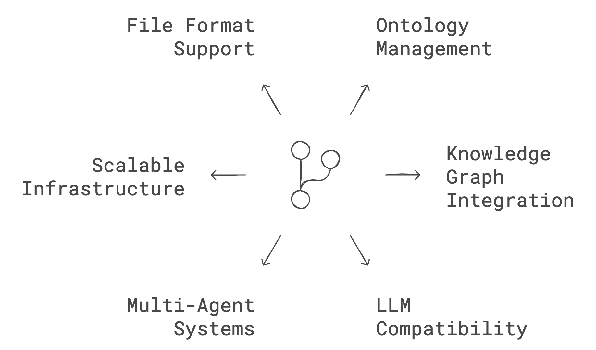

<p align="center">
  

[](https://hub.docker.com/r/falkordb/falkordb/)
[](https://pypi.org/project/graphrag_sdk/)
[](https://discord.gg/6M4QwDXn2w)
[](code_of_conduct.md) 
</p>

# What is GraphRAD-SDK?

[](https://app.falkordb.cloud)

Simplify the development of your next GenAI application with GraphRAG-SDK, a specialized toolkit for building Graph Retrieval-Augmented Generation (GraphRAG) systems. It integrates knowledge graphs, ontology management, and state-of-the-art LLMs to deliver accurate, efficient, and customizable RAG workflows.


## Key Features
<p align="center">
  
</p>


* **Ontology Management:** Automate ontology creation from unstructured data or define it manually.
* **Knowledge Graph Integration:** Build, query, and manage knowledge graphs optimized for retrieval and augmentation tasks.
* **LLM Compatibility:** Supports OpenAI GPT models, Google Gemini, Azure-OpenAI, Ollama, Multi-modality framework LiteLLM.
* **Multi-Agent Systems:** Orchestrate specialized agents for domain-specific tasks with knowledge graph-driven intelligence.
* **Scalable Infrastructure:** Leverages FalkorDB for high-performance graph querying and multi-tenancy.
* **Extensive File Format Support:** Ingest data from PDFs, CSVs, JSONL, HTML, and more.

## Quick Start Guide

### Install with all dependencies:

```sh
pip install graphrag_sdk[all]
```

### For OpenAI-only integration:

```sh
pip install graphrag_sdk[openai]
```

### Prerequisites:

#### Graph Database
GraphRAD-SDK uses FalkorDB as its graph engine.
* **[FalkorDB Cloud](https://app.falkordb.cloud/):** Obtain credentials from the cloud dashboard.
* **Local Deployment:**

```sh
docker run -p 6379:6379 -p 3000:3000 -it --rm  -v ./data:/data falkordb/falkordb:latest
```

#### LLM API Keys
Configure credentials for your chosen LLM provider. See .env.template for examples.

* [OpenAI](https://openai.com/index/openai-api) Recommended model:`gpt-4o`
* [Google](https://makersuite.google.com/app/apikey) Recommended model:`gemini-1.5-flash-001`
* [Azure-OpenAI](https://ai.azure.com) Recommended model:`gpt-4o`
* [Ollama](https://ollama.com/) Available only to the Q&A step. Recommended models: `llama3`. Ollama models are suitable for the Q&A step only (after the knowledge graph (KG) created).

## Examples
### Basic Usage
[](https://colab.research.google.com/github/FalkorDB/GraphRAG-SDK/blob/main/examples/movies/demo-movies.ipynb)

Create a knowledge graph from a set of URLs and perform a query:

```python
from dotenv import load_dotenv

from graphrag_sdk.source import URL
from graphrag_sdk import KnowledgeGraph, Ontology
from graphrag_sdk.models.openai import OpenAiGenerativeModel
from graphrag_sdk.model_config import KnowledgeGraphModelConfig
load_dotenv()

# Import Data
urls = ["https://www.rottentomatoes.com/m/side_by_side_2012",
"https://www.rottentomatoes.com/m/matrix",
"https://www.rottentomatoes.com/m/matrix_revolutions",
"https://www.rottentomatoes.com/m/matrix_reloaded",
"https://www.rottentomatoes.com/m/speed_1994",
"https://www.rottentomatoes.com/m/john_wick_chapter_4"]

sources = [URL(url) for url in urls]

# Model
model = OpenAiGenerativeModel(model_name="gpt-4o")

# Ontology Auto-Detection
ontology = Ontology.from_sources(
    sources=sources,
    model=model,
)

# Knowledge Graph
kg = KnowledgeGraph(
    name="movies",
    model_config=KnowledgeGraphModelConfig.with_model(model),
    ontology=ontology,
)

# GraphRAG System and Questioning
kg.process_sources(sources)

chat = kg.chat_session()

print(chat.send_message("Who is the director of the movie The Matrix?"))
print(chat.send_message("How this director connected to Keanu Reeves?"))

```

### Multi-Agent Orchestration
[](https://colab.research.google.com/github/FalkorDB/GraphRAG-SDK/blob/main/examples/trip/demo_orchestrator_trip.ipynb)
Define specialized agents and manage their interactions:
```python
TBD
```

## Use Cases
* **Enterprise Search:** Enable domain-specific searches with LLM-augmented responses.
* **Customer Support:** Automate Q&A systems using domain-trained agents.
* **Research Tools:** Build domain-specific research assistants for structured and unstructured data.

## FAQ
**Which databases are supported?**

GraphRAD-SDK is optimized for FalkorDB. Other backends may require adapters.

**How scalable is the SDK?**

GraphRAD-SDK is designed for multi-tenancy and large-scale applications. Performance depends on FalkorDB deployment configuration.

**Can I define custom embeddings?**

Yes. You can override the default embedding pipeline by defining your own embedding functions.

**What is GraphRAG?**

GraphRAG combines traditional retrieval-augmented generation (RAG) systems with the power of knowledge graphs to enhance accuracy, contextual relevance, and 
efficiency.

**How does this SDK improve retrieval-augmented generation?**

By leveraging knowledge graphs, GraphRAD-SDK enables semantic relationships and ontology-driven queries that go beyond standard vector similarity.

**Which file formats does the SDK support?**

Supported formats include PDF, JSONL, CSV, HTML, TEXT, and URLs.

**How does the SDK handle latency?**

The SDK is optimized for low-latency operations through FalkorDB, using techniques like query optimization and in-memory processing.

**Does the SDK support multi-graph querying?**

Yes. Multi-graph querying is supported with APIs designed for cross-domain and hierarchical graph exploration.

**Can I use custom embeddings?**

Yes. The SDK allows overriding default embedding mechanisms to use custom or domain-specific embeddings.


## Community and Support

Have questions or feedback? Reach out via:
- [GitHub Issues](https://github.com/orgs/FalkorDB/issues)
- Join our [Discord](https://discord.com/invite/6M4QwDXn2w)


### Heading 3: License

This project is licensed under the MIT License. See the [LICENSE](LICENSE) file for details.


### Heading 3: How to Contribute

### Heading 3: Acknowledgements


⭐️ If you find this repository helpful, please consider giving it a star!

Keywords: RAG, graphrag, Retrieval-Augmented Generation, NLP, AI, Information Retrieval, Natural Language Processing, LLM, Embeddings, Semantic Search
