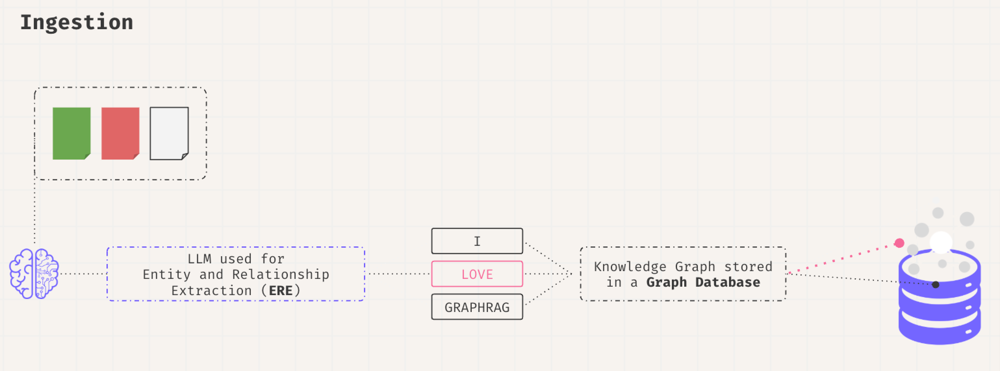
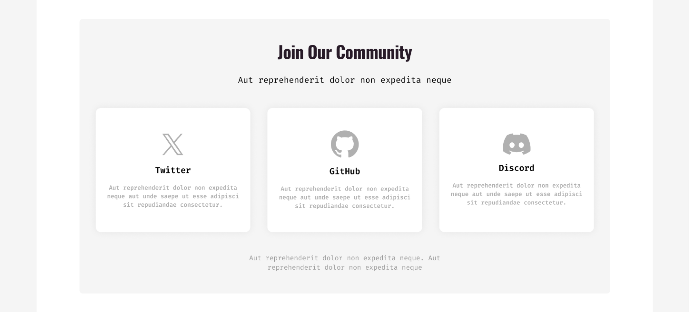

**GraphRAG** 
[](https://hub.docker.com/r/falkordb/falkordb/)
[](https://pypi.org/project/graphrag_sdk/)
[](https://discord.gg/6M4QwDXn2w)
[](code_of_conduct.md) 
<p align="center">
  
</p>
Build fast and accurate GenAI apps with GraphRAG SDK at scale.

Documentation available at: [LINK](https://www.falkordb.com/)

[](https://app.falkordb.cloud)


# What’s included?

LLM Support Banner

* **Ontology Management:** Automate ontology creation from unstructured data or define it manually.
* **Knowledge Graph Integration:** Build, query, and manage knowledge graphs optimized for retrieval and augmentation tasks.
* **LLM Compatibility:** Supports OpenAI GPT models, Google Gemini, Azure-OpenAI, Ollama, Multi-modality framework LiteLLM.
* **Multi-Agent Systems:** Orchestrate specialized agents for domain-specific tasks with knowledge graph-driven intelligence.
* **Scalable Infrastructure:** Leverages FalkorDB for high-performance graph querying and multi-tenancy.
* **Extensive File Format Support:** Ingest data from PDFs, CSVs, JSONL, HTML, and more.

Simplify the development of your next GenAI application with GraphRAG-SDK, a specialized toolkit for building Graph Retrieval-Augmented Generation (GraphRAG) systems. It integrates knowledge graphs, ontology management, and state-of-the-art LLMs to deliver accurate, efficient, and customizable RAG workflows.


## Key Features
<p align="center">
  
</p>

* **Ontology Management:** Automate ontology creation from unstructured data or define it manually.
* **Knowledge Graph Integration:** Build, query, and manage knowledge graphs optimized for retrieval and augmentation tasks.
* **LLM Compatibility:** Supports OpenAI GPT models, Google Gemini, Azure-OpenAI, Ollama, Multi-modality framework LiteLLM.
* **Multi-Agent Systems:** Orchestrate specialized agents for domain-specific tasks with knowledge graph-driven intelligence.
* **Scalable Infrastructure:** Leverages FalkorDB for high-performance graph querying and multi-tenancy.
* **Extensive File Format Support:** Ingest data from PDFs, CSVs, JSONL, HTML, and more.

<p align="center">
  
</p>

# GraphRAG Setup
### Graph Database Setup
GraphRAG uses FalkorDB as its graph engine.
* **[FalkorDB Cloud](https://app.falkordb.cloud/):** Obtain credentials from the cloud dashboard.
* **Local Deployment:**

```sh
docker run -p 6379:6379 -p 3000:3000 -it --rm  -v ./data:/data falkordb/falkordb:latest
```

### dependencies:

For all dependencies
```sh
pip install graphrag_sdk[all]
```
Only OpenAI
```sh
pip install graphrag_sdk[openai]
```
### Configure Credentials. See .env.template for examples.

* [OpenAI](https://openai.com/index/openai-api) Recommended model:`gpt-4o`
* [Google](https://makersuite.google.com/app/apikey) Recommended model:`gemini-1.5-flash-001`
* [Azure-OpenAI](https://ai.azure.com) Recommended model:`gpt-4o`
* [Ollama](https://ollama.com/) Available only to the Q&A step. Recommended models: `llama3`. Ollama models are suitable for the Q&A step only (after the knowledge graph (KG) created).


# How to use
### Importing your data
Banner

### Creating Ontologies
Automate ontology creation from unstructured data or define it manually.

```python
from dotenv import load_dotenv

from graphrag_sdk.source import URL
from graphrag_sdk import KnowledgeGraph, Ontology
from graphrag_sdk.models.openai import OpenAiGenerativeModel
from graphrag_sdk.model_config import KnowledgeGraphModelConfig
load_dotenv()

# Import Data
urls = ["https://www.rottentomatoes.com/m/side_by_side_2012",
"https://www.rottentomatoes.com/m/matrix",
"https://www.rottentomatoes.com/m/matrix_revolutions",
"https://www.rottentomatoes.com/m/matrix_reloaded",
"https://www.rottentomatoes.com/m/speed_1994",
"https://www.rottentomatoes.com/m/john_wick_chapter_4"]

sources = [URL(url) for url in urls]

# Model
model = OpenAiGenerativeModel(model_name="gpt-4o")

# Ontology Auto-Detection
ontology = Ontology.from_sources(
    sources=sources,
    model=model,
)
# Save the ontology to the disk as a json file.
with open("ontology.json", "w", encoding="utf-8") as file:
    file.write(json.dumps(ontology.to_json(), indent=2))
```

### Creating a knowledge graph agent
Build, query, and manage knowledge graphs optimized for retrieval and augmentation tasks. 
Leverages FalkorDB for high-performance graph querying and multi-tenancy.

```python

# After approving the ontology, load it from disk.
ontology_file = "ontology.json"
with open(ontology_file, "r", encoding="utf-8") as file:
    ontology = Ontology.from_json(json.loads(file.read()))

kg = KnowledgeGraph(
    name="kg_name",
    model_config=KnowledgeGraphModelConfig.with_model(model),
    ontology=ontology,
)

kg.process_sources(sources)
```

### Configuring your prompts
When creating your Knowledge Graph (KG) agent, you can customize the prompts to tailor its behavior. This step is optional but can enhance functionality.

There are five types of prompts:

1. **`cypher_system_instruction`**  
   - System instructions for the Cypher generation step.  
   - **Note:** Ensure your prompt includes `{ontology}`.

2. **`qa_system_instruction`**  
   - System instructions for the Q&A step.

3. **`cypher_gen_prompt`**  
   - The prompt used during the Cypher generation step.  
   - **Note:** Include `{question}` in your prompt.

4. **`cypher_gen_prompt_history`**  
   - The prompt for Cypher generation when history needs to be considered.  
   - **Note:** Include `{question}` and `{last_answer}` in your prompt.

5. **`qa_prompt`**  
   - The prompt used during the Q&A step.  
   - **Note:** Include `{question}`, `{context}`, and `{cypher}` in your prompt.

Here’s an example configuration:

```python
kg = KnowledgeGraph(
    name="kg_name",
    model_config=KnowledgeGraphModelConfig.with_model(model),
    ontology=ontology,
    cypher_system_instruction=cypher_system_instruction,
    qa_system_instruction=qa_system_instruction,
    cypher_gen_prompt=cypher_gen_prompt,
    cypher_gen_prompt_history=cypher_gen_prompt_history,
    qa_prompt=qa_prompt
)
```

### Graph RAG

At this point, you have a Knowledge Graph that can be queried using this SDK. Use the method `chat_session` for start a conversation.

```python

# Conversation.
chat = kg.chat_session()
response = chat.send_message("Who is Salsa Boy?")
print(response)
response = chat.send_message("Tell me about one of his fights?")
print(response)
```

## Multi Agent - Orchestrator

[](https://colab.research.google.com/github/FalkorDB/GraphRAG-SDK/blob/main/examples/trip/demo_orchestrator_trip.ipynb)

The GraphRAG-SDK supports KG agents. Each agent is an expert in the data it has learned, and the orchestrator orchestrates the agents.

### Agents

See the [Basic Usage](#basic-usage) section to understand how to create KG objects for the agents.

```python
# Define the model
model = OpenAiGenerativeModel("gpt-4o")

# Create the KG from the predefined ontology.
# In this example, we will use the restaurants agent and the attractions agent.
restaurants_kg = KnowledgeGraph(
    name="restaurants",
    ontology=restaurants_ontology,
    model_config=KnowledgeGraphModelConfig.with_model(model),
)
attractions_kg = KnowledgeGraph(
    name="attractions",
    ontology=attractions_ontology,
    model_config=KnowledgeGraphModelConfig.with_model(model),
)


# The following agent is specialized in finding restaurants.
restaurants_agent = KGAgent(
    agent_id="restaurants_agent",
    kg=restaurants_kg,
    introduction="I'm a restaurant agent, specialized in finding the best restaurants for you.",
)

# The following agent is specialized in finding tourist attractions.
attractions_agent = KGAgent(
    agent_id="attractions_agent",
    kg=attractions_kg,
    introduction="I'm an attractions agent, specialized in finding the best tourist attractions for you.",
)
```

### Orchestrator - Multi-Agent System

The orchestrator manages the usage of agents and handles questioning.

```python
# Initialize the orchestrator while giving it the backstory.
orchestrator = Orchestrator(
    model,
    backstory="You are a trip planner, and you want to provide the best possible itinerary for your clients.",
)

# Register the agents that we created above.
orchestrator.register_agent(restaurants_agent)
orchestrator.register_agent(attractions_agent)

# Query the orchestrator.
runner = orchestrator.ask("Create a two-day itinerary for a trip to Rome. Please don't ask me any questions; just provide the best itinerary you can.")
print(runner.output)

```

## Use cases
Banner

* Enterprise Search: Enable domain-specific searches with LLM-augmented responses.
* Customer Support: Automate Q&A systems using domain-trained agents.
* Research Tools: Build domain-specific research assistants for structured and unstructured data

## Use Cases
* **Enterprise Search:** Enable domain-specific searches with LLM-augmented responses.
* **Customer Support:** Automate Q&A systems using domain-trained agents.
* **Research Tools:** Build domain-specific research assistants for structured and unstructured data.

## FAQ
**Which databases are supported?**

GraphRAD-SDK is optimized for FalkorDB. Other backends may require adapters.

**How scalable is the SDK?**

GraphRAD-SDK is designed for multi-tenancy and large-scale applications. Performance depends on FalkorDB deployment configuration.

**Can I define custom embeddings?**

Yes. You can override the default embedding pipeline by defining your own embedding functions.

**What is GraphRAG?**

GraphRAG combines traditional retrieval-augmented generation (RAG) systems with the power of knowledge graphs to enhance accuracy, contextual relevance, and 
efficiency.

**How does this SDK improve retrieval-augmented generation?**

By leveraging knowledge graphs, GraphRAD-SDK enables semantic relationships and ontology-driven queries that go beyond standard vector similarity.

**Which file formats does the SDK support?**

Supported formats include PDF, JSONL, CSV, HTML, TEXT, and URLs.

**How does the SDK handle latency?**

The SDK is optimized for low-latency operations through FalkorDB, using techniques like query optimization and in-memory processing.

**Does the SDK support multi-graph querying?**

Yes. Multi-graph querying is supported with APIs designed for cross-domain and hierarchical graph exploration.

**Can I use custom embeddings?**

Yes. The SDK allows overriding default embedding mechanisms to use custom or domain-specific embeddings.


## Community

<p align="center">
  
</p>


Have questions or feedback? Reach out via:
- [GitHub Issues](https://github.com/orgs/FalkorDB/issues)
- Join our [Discord](https://discord.com/invite/6M4QwDXn2w)

⭐️ If you find this repository helpful, please consider giving it a star!

Keywords: RAG, graphrag, Retrieval-Augmented Generation, NLP, AI, Information Retrieval, Natural Language Processing, LLM, Embeddings, Semantic Search

### Heading 3: License

This project is licensed under the MIT License. See the [LICENSE](LICENSE) file for details.


