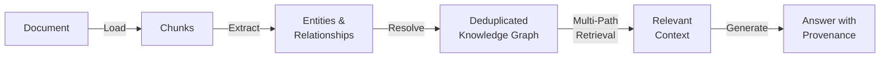

<!-- Replace with assets/logo.png when available:
<p align="center">
  
</p>
-->

<h1 align="center">GraphRAG SDK</h1>

<p align="center">
  <strong>The most accurate Graph RAG framework. Built on <a href="https://www.falkordb.com/">FalkorDB</a>.</strong>
</p>

<p align="center">
  <a href="https://www.python.org/downloads/"></a>
  <a href="LICENSE"></a>
  <!-- <a href="https://pypi.org/project/graphrag-sdk/"></a> -->
  <a href="graphrag_sdk/tests/"></a>
  <a href="https://github.com/FalkorDB/GraphRAG-SDK/actions"></a>
  <!-- <a href="https://discord.gg/INVITE_CODE"></a> -->
  <a href="https://github.com/FalkorDB/GraphRAG-SDK"></a>
</p>

<p align="center">
  If GraphRAG SDK is useful to you, consider giving it a star to help others discover the project.
</p>

---

## Get Started in 30 Seconds

<details open>
<summary><strong>Using OpenAI</strong></summary>

```python
import asyncio
from graphrag_sdk import GraphRAG, ConnectionConfig, LiteLLM, LiteLLMEmbedder

async def main():
    async with GraphRAG(
        connection=ConnectionConfig(host="localhost", graph_name="my_graph"),
        llm=LiteLLM(model="openai/gpt-4o"),
        embedder=LiteLLMEmbedder(model="openai/text-embedding-3-small"),
    ) as rag:
        await rag.ingest("my_document.pdf")
        await rag.finalize()
        answer = await rag.completion("What is the main topic?")
        print(answer.answer)

asyncio.run(main())
```

</details>

<details>
<summary><strong>Using Azure OpenAI</strong></summary>

```python
import asyncio
from graphrag_sdk import GraphRAG, ConnectionConfig, LiteLLM, LiteLLMEmbedder

async def main():
    async with GraphRAG(
        connection=ConnectionConfig(host="localhost", graph_name="my_graph"),
        llm=LiteLLM(model="azure/gpt-4.1"),
        embedder=LiteLLMEmbedder(model="azure/text-embedding-ada-002"),
    ) as rag:
        await rag.ingest("my_document.pdf")
        await rag.finalize()
        answer = await rag.completion("What is the main topic?")
        print(answer.answer)

asyncio.run(main())
```

Set these environment variables for Azure:

```bash
export AZURE_OPENAI_API_KEY="your-key"
export AZURE_OPENAI_ENDPOINT="https://your-endpoint.openai.azure.com/"
export AZURE_OPENAI_API_VERSION="2024-12-01-preview"
```

</details>

---

## Benchmark Results

**~85% accuracy** on a 100-question literary benchmark across 20 Project Gutenberg novels, evaluated with LLM-as-Judge scoring (GPT-4.1).

| Question Type | Score | Questions |
|---------------|-------|-----------|
| Fact Retrieval | 9.0 / 10 | 42 |
| Contextual Summarization | 8.9 / 10 | 18 |
| Complex Reasoning | 8.5 / 10 | 37 |
| Creative Generation | 8.3 / 10 | 3 |
| **Overall** | **8.5 / 10** | **100** |

See [docs/benchmark.md](docs/benchmark.md) for full methodology and reproduction instructions.

---

## How It Works


```mermaid
graph LR
    A["Document"] -->|Load| B["Chunks"]
    B -->|Extract| C["Entities &<br/>Relationships"]
    C -->|Resolve| D["Deduplicated<br/>Knowledge Graph"]
    D -->|Multi-Path<br/>Retrieval| E["Relevant<br/>Context"]
    E -->|Generate| F["Answer with<br/>Provenance"]
```

**9-step ingestion pipeline** (7 sequential + 2 parallel):

1. **Load** -- Read raw text from files (PDF, TXT) or strings
2. **Chunk** -- Split into overlapping text chunks
3. **Lexical Graph** -- Create Document and Chunk nodes with provenance edges
4. **Extract** -- GLiNER2 local NER + LLM relationship extraction
5. **Quality Filter** -- Filter extracted data against schema
6. **Prune** -- Remove low-quality extractions
7. **Resolve** -- Deduplicate entities (exact match, semantic, LLM-verified)
8. **Write** -- Batched MERGE to FalkorDB
9. **Mentions + Index** -- (parallel) Link entities to source chunks, embed and index chunks

**Multi-path retrieval** combines vector search, fulltext search, Cypher queries, relationship expansion, and cosine reranking -- every answer traces back to its source sentence.

---

## Why GraphRAG SDK?

- **Highest accuracy** -- ~85% on standardized benchmark, outperforming leading GraphRAG frameworks
- **Simple API** -- `ingest()` + `completion()`. Sensible defaults, no pipeline configuration needed
- **Multi-turn conversations** -- Native chat history support via `ChatMessage` with built-in provider support
- **100+ LLM providers** -- OpenAI, Azure, Anthropic, Cohere, Ollama, and more via [LiteLLM](https://github.com/BerriAI/litellm)
- **Fully modular** -- Every pipeline step (chunking, extraction, resolution, retrieval, reranking) is a swappable strategy behind an ABC
- **Production-ready** -- Async-first, connection pooling, circuit breaker, batched writes, retry logic
- **Full provenance** -- Every answer traces through entities, relationships, and chunks back to the source document
- **PDF support** -- Ingest PDF, TXT, or raw strings. Auto-detects file type
- **Schema-guided extraction** -- Define entity types and relationship patterns to constrain LLM extraction

---

## Installation

```bash
pip install graphrag-sdk[litellm]
```

| Extra | What it adds |
|-------|-------------|
| `graphrag-sdk[litellm]` | OpenAI, Azure, Anthropic, Cohere, 100+ LLM providers |
| `graphrag-sdk[openrouter]` | OpenRouter models |
| `graphrag-sdk[pdf]` | PDF ingestion via pypdf |
| `graphrag-sdk[all]` | Everything above |

### Prerequisites

**FalkorDB** (graph database):

```bash
# Option A: Docker Compose (recommended)
docker compose up -d

# Option B: Docker run
docker run -p 6379:6379 falkordb/falkordb
```

**LLM API key** -- set `OPENAI_API_KEY` or your provider's key as an environment variable.

---

## Quick Start

### 1. Install and start FalkorDB

```bash
pip install graphrag-sdk[litellm]
docker compose up -d
```

### 2. Ingest a document

```python
import asyncio
from graphrag_sdk import GraphRAG, ConnectionConfig, LiteLLM, LiteLLMEmbedder

async def main():
    async with GraphRAG(
        connection=ConnectionConfig(host="localhost", graph_name="my_graph"),
        llm=LiteLLM(model="openai/gpt-4o"),
        embedder=LiteLLMEmbedder(model="openai/text-embedding-3-small"),
    ) as rag:
        # Ingest from file (auto-detects PDF vs text)
        result = await rag.ingest("my_document.pdf")
        print(f"Nodes: {result.nodes_created}, Edges: {result.relationships_created}")

        # Finalize: deduplicate entities, backfill embeddings, create indexes
        await rag.finalize()

        # Retrieve context only
        context = await rag.retrieve("Who are the main characters?")

        # Full RAG: retrieve + generate answer
        answer = await rag.completion("Who are the main characters?")
        print(answer.answer)

asyncio.run(main())
```

### 3. Multi-turn conversations

```python
from graphrag_sdk import ChatMessage

answer = await rag.completion(
    "What happened to her after that?",
    history=[
        ChatMessage(role="user", content="Who is Alice?"),
        ChatMessage(role="assistant", content="Alice is a software engineer at Acme Corp."),
    ],
)
```

### 4. Define a schema (optional)

```python
from graphrag_sdk import GraphSchema, EntityType, RelationType, SchemaPattern

schema = GraphSchema(
    entities=[
        EntityType(label="Person", description="A human being"),
        EntityType(label="Organization", description="A company or institution"),
        EntityType(label="Location", description="A geographic location"),
    ],
    relations=[
        RelationType(label="WORKS_AT", description="Is employed by"),
        RelationType(label="LOCATED_IN", description="Is situated in"),
    ],
    patterns=[
        SchemaPattern(source="Person", relationship="WORKS_AT", target="Organization"),
        SchemaPattern(source="Organization", relationship="LOCATED_IN", target="Location"),
    ],
)

rag = GraphRAG(connection=conn, llm=llm, embedder=embedder, schema=schema)
```

---

## Strategy Reference

Every algorithmic concern is a swappable strategy behind an abstract base class:

| Concern | ABC | Built-in Options | Default |
|---------|-----|-----------------|---------|
| **Loading** | `LoaderStrategy` | `TextLoader`, `PdfLoader` | Auto-detect by extension |
| **Chunking** | `ChunkingStrategy` | `FixedSizeChunking`, `SentenceTokenCapChunking`, `ContextualChunking`, `CallableChunking` | `FixedSizeChunking` |
| **Extraction** | `ExtractionStrategy` | `GraphExtraction` (GLiNER2 + LLM) | `GraphExtraction` |
| **Resolution** | `ResolutionStrategy` | `ExactMatchResolution`, `DescriptionMergeResolution`, `SemanticResolution`, `LLMVerifiedResolution` | `ExactMatch` |
| **Retrieval** | `RetrievalStrategy` | `LocalRetrieval`, `MultiPathRetrieval` | `MultiPath` (5-path) |
| **Reranking** | `RerankingStrategy` | `CosineReranker` | Cosine |

### LLM & Embedding Providers

| Provider | LLM Class | Embedder Class | Models |
|----------|-----------|---------------|--------|
| **LiteLLM** | `LiteLLM` | `LiteLLMEmbedder` | OpenAI, Azure, Anthropic, Cohere, 100+ |
| **OpenRouter** | `OpenRouterLLM` | `OpenRouterEmbedder` | All OpenRouter models |
| **Custom** | Subclass `LLMInterface` | Subclass `Embedder` | Anything |

---

## Examples

| # | Example | What it demonstrates |
|---|---------|---------------------|
| 1 | [Quick Start](graphrag_sdk/examples/01_quickstart.py) | Minimal ingest + query |
| 2 | [PDF with Schema](graphrag_sdk/examples/02_pdf_with_schema.py) | PDF ingestion with custom entity types |
| 3 | [Custom Strategies](graphrag_sdk/examples/03_custom_strategies.py) | Benchmark-winning pipeline configuration |
| 4 | [Custom Provider](graphrag_sdk/examples/04_custom_provider.py) | Implement your own LLM/Embedder |
| 5 | [Notebook Demo](graphrag_sdk/examples/05_notebook_demo.ipynb) | Interactive walkthrough with provenance inspection |

---

## Documentation

| Guide | Description |
|-------|-------------|
| [Getting Started](docs/getting-started.md) | Step-by-step tutorial from install to first query |
| [Architecture](docs/architecture.md) | Pipeline design, graph schema, retrieval strategy |
| [Configuration](docs/configuration.md) | Connection, providers, and tuning reference |
| [Strategies](docs/strategies.md) | All ABCs and built-in implementations |
| [Providers](docs/providers.md) | LLM and embedder configuration guide |
| [Benchmark](docs/benchmark.md) | Methodology, results, and reproduction instructions |
| [API Reference](docs/api-reference.md) | Full API documentation |

---

## Contributing

We welcome contributions! See [CONTRIBUTING.md](CONTRIBUTING.md) for development setup, testing, and code style guidelines.

Please read our [Code of Conduct](CODE_OF_CONDUCT.md) before participating.

<!-- ### Community

- [Discord](https://discord.gg/INVITE_CODE) -- Ask questions, share what you build
- [GitHub Discussions](https://github.com/FalkorDB/GraphRAG-SDK/discussions) -- Feature ideas, Q&A
- [Issues](https://github.com/FalkorDB/GraphRAG-SDK/issues) -- Bug reports and feature requests
-->

---

## Citation

If you use GraphRAG SDK in your research, please cite:

```bibtex
@software{graphrag_sdk,
  title  = {GraphRAG SDK: A Modular Graph RAG Framework},
  author = {FalkorDB},
  year   = {2026},
  url    = {https://github.com/FalkorDB/GraphRAG-SDK},
}
```

---

## License

[Apache License 2.0](LICENSE)
