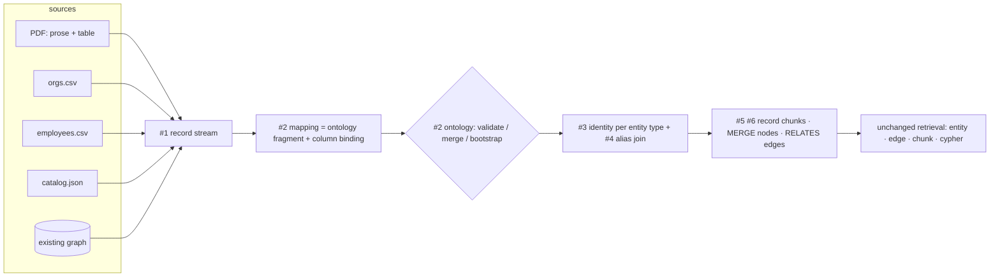

# Design: Structured Data Ingestion

**Status:** Proposed, spike-validated · **Tracking:** [FalkorDB/research#82][i82] (POC) · design from [research#65][i65] · supersedes [GraphRAG-SDK#74][i74]

The proposals in §3 were tested by five throwaway spikes against a live FalkorDB before this
document settled — see [§10](#10-spike-results). Four of them corrected something here.

[i82]: https://github.com/FalkorDB/research/issues/82
[i65]: https://github.com/FalkorDB/research/issues/65
[i74]: https://github.com/FalkorDB/GraphRAG-SDK/issues/74

---

## 1. Problem

`rag.ingest(...)` assumes one shape of input: a blob of prose.

```
load → chunk → lexical graph → LLM extract → prune → resolve → write → mentions → index
```

Structured inputs break three assumptions of that pipeline at once:

| Assumption (unstructured) | Reality (structured) |
| --- | --- |
| The schema is unknown and must be discovered by an LLM | The schema is already in the header row / JSON keys / source graph |
| Entity identity must be guessed from a surface string | Row identity is explicit and typed |
| Column values are prose to be re-described | Values are typed scalars that must survive as typed graph properties |

Today a mixed corpus (PDFs + a CRM export + a JSON catalog + a table lifted out of a PDF) needs a
bespoke loader per format, or pre-flattening to text — which discards exactly the structure that
made the source valuable, and spends an LLM call per row re-deriving what was already known.

### 1.1 The sources this must serve

The design has to hold for all of these at once, because a real corpus contains all of them:

1. **`employees.csv`** — one row = one `Person`, with an `org_id` foreign key.
2. **`orgs.csv`** — one row = one `Organization`. Different shape, different columns, same graph.
3. **`transactions.csv`** — one row = an *event between two entities*; the row is a fact, not a thing.
4. **A table lifted out of a PDF** — rows embedded in a document that also contains prose about
   the same entities. Table and prose must land in one connected subgraph.
5. **Nested JSON** — objects with sub-objects and arrays; the nesting *is* relationship structure.
6. **An existing graph** — nodes and edges already exist, possibly with their own ontology,
   possibly with none.

### 1.2 Invariants of the current SDK

Anything we design must respect what is already load-bearing, or retrieval silently degrades.
Each of these was verified against the code:

- **Every data edge is `RELATES` with a `rel_type` property**
  (`extraction_strategies/graph_extraction.py::_relations_to_relationships`). Edge vector search,
  `chunk_retrieval`'s neighbour expansion, and the text-to-Cypher prompt all assume it.
- **Node id = `compute_entity_id(name, label)`** → `"acme corp"` + `Organization` →
  `acme_corp__organization`. Nodes carry `__Entity__` plus their type label.
- **The lexical graph is mandatory.** `Document -[PART_OF]-> Chunk`,
  `Chunk -[NEXT_CHUNK]-> Chunk`, `Entity -[MENTIONED_IN]-> Chunk`. `update()` and
  `delete_document()` orphan cleanup is defined *entirely* over this chain
  (`delete_orphan_entities` matches `WHERE NOT (e)-[:MENTIONED_IN]->(:Chunk)`), and its
  correctness under concurrency depends on mentions being persisted before `pipeline.run()`
  returns.
- **`finalize()` embeds `Entity.name`** into the entity vector index (`backfill_entity_embeddings`
  selects `e.name`) and **`RELATES.fact`** into the edge vector index (`embed_relationships`
  filters `WHERE r.fact IS NOT NULL`). A node without `name` or an edge without `fact` is
  unreachable by vector search.
- **`delete_stale_relationships` garbage-collects edges via `RELATES.source_chunk_ids`.** An edge
  without that property is never cleaned up.

---

## 2. The design in one paragraph

**Reduce every structured source to a stream of flat records, and let one declarative mapping
turn records into typed nodes and `RELATES` edges.** The mapping is not a new schema language —
it *is* an ontology fragment plus a column binding, so declaring a mapping declares (or validates
against) the ontology. Identity is declared **once per entity type in the ontology**, not per
source, so differently-shaped CSVs, a PDF table, and a JSON file converge on the same nodes by
construction rather than by fuzzy post-hoc merging. Records are persisted as `Chunk` nodes in the
normal lexical graph, so provenance, `update()`, `delete_document()`, and all four retrieval
paths work on structured data with **zero changes to retrieval**. No LLM is called per row.

---

## 3. The proposals, in build order

Proposals **#1–#7 are the POC**. **#8–#12** are follow-ups.



---

### #1 — `RecordBatch`: one intermediate representation for all structured input

**What.** A single contract every structured source reduces to: a stream of flat
`dict[str, Any]` plus source metadata. It sits *next to* today's `LoaderStrategy`, not in
place of it.

```python
class RecordLoaderStrategy(ABC):
    async def load_records(self, source: str, ctx: Context) -> RecordBatch: ...

class RecordBatch(DataModel):
    open_records: Callable[[], Iterator[dict[str, Any]]]  # a stream *factory* — see below
    document_info: DocumentInfo
    inferred_types: dict[str, str]      # column -> STRING/INTEGER/... hint from the reader
    record_count: int | None = None     # when the loader knows it cheaply; None when streaming

    def __iter__(self) -> Iterator[dict[str, Any]]:
        return self.open_records()
```

!!! warning "A factory, not an iterable — [spike s1][s1] corrected this"
    The obvious signature `records: Iterable[dict[str, Any]]` **does not work**. Pydantic v2 keeps
    it lazy (good: 200k rows cost ~0 MB vs 71.6 MB materialised) but replaces it with a *one-shot*
    `ValidatorIterator`. #6 iterates records twice — step 3 builds record chunks, step 4 maps
    records to `GraphData` — and the measured result is `step 3 saw 10 records, step 4 saw 0`, with
    **no error raised**: a silent zero-row ingest. The annotation also erases list-ness, so `len()`
    raises even when the caller passed a list, leaving no cheap count for progress reporting.
    A factory is re-iterable by construction and verified `model_dump()`-safe.

    Loaders therefore hand over a *re-openable* source (reopen the file, re-run the cursor). Where a
    source genuinely cannot be read twice, the loader spools once and closes over the buffer — which
    makes the memory cost explicit at the loader instead of silently corrupting the write.

**Why.** Without it we get one bespoke code path per format — the exact problem #82 is filed
against. With it, a new format is a ~50-line loader and *nothing else changes*. It also dissolves
the two awkward sources:

- a **table inside a PDF** is a record stream whose `DocumentInfo` is the PDF's, so its rows
  become chunks of the *same* `Document` node as the prose — table and prose are connected before
  any entity resolution runs;
- an **existing graph** is *two* record streams (nodes and edges), because a graph is just a node
  table plus an edge table.

| Source | Records are |
| --- | --- |
| CSV / TSV / XLSX / Parquet | rows |
| JSONL | one object per line |
| nested JSON | a declared `record_path` (`$.orders[*]`); nested objects flatten to `customer.name`; nested arrays → `LIST` or child records |
| table in a PDF / DOCX | the table's rows, carrying the parent document + section |
| existing graph | node stream + edge stream |

---

### #2 — The mapping DSL, which doubles as an ontology fragment

**What.** `RecordMapping` / `NodeMapping` / `EdgeMapping`, plus `mapping.to_ontology()`.
Progressive disclosure — the 80% case is one line:

```python
# One row = one entity.
await rag.ingest("orgs.csv", mapping=Table(node="Organization", key="org_name"))
```

The general case is a denormalized row producing several nodes and the edges between them. Each
`NodeMapping` carries an **alias** — a handle unique *within the record* — and edges address
aliases, never labels:

```python
mapping = RecordMapping(
    nodes=[
        NodeMapping(alias="employee", label="Person", key="employee_id", name="full_name",
                    properties={"age": "age", "title": "job_title"}),
        NodeMapping(alias="employer", label="Organization", key="org_id", reference=True),
    ],
    edges=[
        EdgeMapping(type="WORKS_AT", source="employee", target="employer",
                    properties={"since": "start_date"}),
    ],
)
```

!!! warning "Edges address aliases, not labels — [spike s2][s2] corrected this"
    The obvious `EdgeMapping(source="Person", target="Organization")` cannot express a record
    containing **two nodes of the same label**. Run against `transactions.csv` — a buyer and a
    seller, both `Organization` — label addressing produced a **self-loop** (`ORG-7 -> ORG-7`
    instead of `ORG-7 -> ORG-42`), silently. Buyer/seller, manager/report, parent/subsidiary and
    origin/destination are the standard shape of transactional data, not an edge case.

    `alias` defaults to the label, so the single-node 80% case above never mentions it.

**Why it doubles as an ontology fragment.** A mapping already declares labels, typed properties
and relation patterns — that is literally the content of `Ontology`. So we do not invent a second
schema language; we project. This single fact is the whole answer to *"the existing graph may or
may not have an ontology"*:

| Graph state | Behaviour |
| --- | --- |
| Ontology exists, mapping is a subset | validate, proceed |
| Ontology exists, mapping adds labels / attributes | `Ontology.merge()` — the additive path `discovery` already uses |
| Ontology exists, mapping **contradicts** it (type mismatch on an existing attribute) | reject **before any write**, naming the offending `Label.attribute` |
| **No ontology** | the mapping **bootstraps** it — the graph becomes self-describing and text-to-Cypher immediately knows the typed columns |
| No ontology *and* no mapping | out of POC scope; later an inference layer proposes a *draft mapping* (see #11) |

**Two guards `to_ontology()` must apply** (both found by [spike s2][s2]):

1. **Reject SDK-reserved attribute names.** A mapping declaring `properties={"description": ...,
   "id": ...}` generates an ontology that shadows values the SDK writes on every node.
   `to_ontology()` rejects `_RESERVED_ATTRIBUTE_NAMES - _SDK_MANAGED_ATTRIBUTE_NAMES`
   (`core/models.py`), naming the offending `Label.attribute` — the same "reject before any write"
   rule already applied to contradictions.
2. **Emit stubs for reference-only labels.** `Ontology._warn_on_undeclared_pattern_labels` fires
   when a relation pattern names a label not in `entities` — which is exactly what a foreign-key
   reference produces. Left alone, every structured ingest logs warnings that train users to ignore
   real ones.

**Three ways an edge arises**, all in the same DSL:

1. **Intra-record** — two `NodeMapping`s in one record (the example above).
2. **Foreign key** — the target is defined in *another* source. We `MERGE` a stub node now and
   enrich it when that source is ingested, so **ingest order does not matter**. This is what makes
   "many differently-shaped CSVs" workable.
3. **Nested containment** — a nested JSON object/array becomes a child node with a declared
   `rel_type` back to its parent.

`CsvMapping` / `JsonMapping` from #65 survive as thin format-flavoured constructors adding reader
options (delimiter, encoding, `record_path`).

**Reified events.** For `transactions.csv`, where the row *is* the fact, the row becomes a node
(`NodeMapping(label="Transaction", ...)`) with two edges out. Row-as-node vs. row-as-edge is the
mapping author's choice, not a format question; the rule of thumb is "does the fact have
properties, or need to be retrieved on its own?"

---

### #3 — Identity declared once on the entity type, not per source

This is the crux, and the thing that makes heterogeneous sources compose.

**What.** Add `identity` to the ontology entity type. **For structured sources it defaults to the
record key**, not to `name`:

```python
Entity(label="Organization", identity=["org_id"])  # structured default: the record key
Entity(label="Product",      identity=["sku"])     # a real cross-system business key
```

Node id becomes `compute_entity_id(<joined identity values>, label)` — **the same function the
unstructured path already uses.**

!!! danger "`identity=["name"]` as the default is wrong — [spike s3][s3] inverted this"
    The first draft of this design defaulted identity to `name`, reasoning that a PDF mention of
    `Acme Corp` and a CSV row `org_name="Acme Corp"` would then compute the same id and merge for
    free. Measured on the #82 acceptance corpus, that loses:

    | Policy | Acme nodes | #82 traversal |
    | --- | --- | --- |
    | name-first (`identity=["name"]`) | 2 | **0 people reachable** |
    | key-only | 2 | **0 people reachable** |
    | key + `alias_ids` (#4) | **1** | **2 people reachable** |

    The reason is that `employees.csv` is a normalised table: it references its organisation by
    `org_id=ORG-42` and has **no `org_name` column**. Under name-first identity the mapping cannot
    compute the identity of the entity it is pointing at, so the rule in #2 — "every mapping must
    supply the type's identity attributes" — is *unsatisfiable for any foreign key*, which is the
    most common structured shape there is.

    The failure is silent: a stub node accumulates all the `WORKS_AT` edges while the real Acme
    node holds the prose, and the two never meet.

**Why.** Separate two things that are usually conflated:

- **Record key** (`NodeMapping.key`) — what makes *re-ingesting this source* idempotent.
  Source-local. Governs the record's chunk id and is stored as an indexed property.
- **Entity identity** — what makes the same real-world thing **one node across all sources**.

With identity declared on the *type*:

- foreign-key references land on the right node **regardless of ingest order** — measured: both
  ingest orders converge to an identical graph for every policy tested;
- differently-shaped CSVs converge because every mapping supplies the type's identity attributes —
  the *sources* differ, the *identity contract* does not;
- if identity were per-mapping, five sources would mean five identity opinions and a disconnected
  graph.

Bridging key-identified structured nodes back to name-identified unstructured mentions is #4 —
which is consequently **on the critical path, not an optional extra**.

!!! note "Free to prototype"
    `Entity(label="Product", identity=["sku"])` already works today: `DataModel.Config.extra =
    "allow"` carries the field and it survives `model_dump()`, so it persists to `ontology.json`.
    Two consequences — `identity` can be prototyped with zero `src` changes, and promoting it to a
    declared field later will not break ontologies persisted in the meantime. It must still become
    a declared field (defaulting to `["name"]` for unstructured-only types) so it is validated
    rather than being a silent typo sink.

---

### #4 — `AliasMatchResolution`: the deterministic bridge, on the critical path

**What.** Structured writes store normalized alias handles on the node, built with
`compute_entity_id` so they are directly comparable to unstructured ids:

```
alias_ids: ["acme_corp__organization", "acme__organization"]   # indexed LIST
```

A new `ResolutionStrategy` merges an incoming node onto an existing node when its id appears in
that node's `alias_ids`.

**Why.** Unstructured extraction can only ever produce a **name** — it can never know an `org_id`
or an SKU. Since #3 identifies structured entities by their record key, *every* entity type that
appears in both a document and a table needs this bridge. [Spike s3][s3] measured it as the only
configuration that yields one Acme node and a working `prose-chunk -> Org -> WORKS_AT -> Person`
traversal. It is:

- **deterministic and index-backed** — no LLM, no embeddings; the spike's implementation is four
  Cypher statements per merged pair;
- **direction-agnostic** — works whether the CSV or the PDF was ingested first;
- **reusable** — because it implements the existing `ResolutionStrategy` ABC, it also works in
  the unstructured pipeline and inside `finalize()`.

!!! warning "Order does not matter, but *presence* does — [spike s3][s3]"
    The bridge is built from whichever source declares both the key and the name (the dimension
    table — `orgs.csv` here). With prose + `employees.csv` and **no** `orgs.csv`, the result
    degrades to 2 Acme nodes and 0 reachable people, because nothing ever carried `ORG-42` and
    `"Acme Corp"` in the same record.

    This is an acceptable requirement, but it must be *visible*: when a mapping references a label
    that no ingested source has declared, `IngestionResult` reports the count of unbridged stubs
    rather than leaving the user with a quietly disconnected graph.

Fuzzy merging (`SemanticResolution`, `LLMVerifiedResolution`, `deduplicate_entities()`) stays
available and unchanged, but is no longer on the critical path. **Make the common join exact;
keep the fuzzy one optional.**

---

### #5 — A record is persisted as a `Chunk`

**What.** Structured records go into the *normal* lexical graph:

- a `Document` node per source;
- one `Chunk` node per record, with `kind="record"`, the record key as a property, and text that
  is a human-readable rendering of the record
  (`"Alice Smith · age 34 · Engineer at Acme Corp"`);
- a **deterministic** chunk uid — `sha256(<effective document uid> + record_key)` instead of
  today's `uuid4()`;
- `MENTIONED_IN` edges from the record's entities to that chunk.

!!! danger "Chunk uids must key on the *effective* document uid — confirmed by [spike s4][s4]"
    **The chunk uid must be derived from the *run's* `DocumentInfo.uid`, never from the canonical
    document id.** During `update()` those differ: the pipeline runs against
    `pending_id = f"{resolved_id}__pending__{uuid4().hex[:8]}"`, and `rollforward_cutover()`
    step 1 calls `delete_document_chunks_and_node(real_id)` *before* promoting the pending.

    This was predicted by reading the code and then **measured against a real FalkorDB through the
    real `GraphStore`**:

    | chunk uid keyed on | chunks before `update()` | chunk nodes shared with pending | **after cutover** |
    | --- | --- | --- | --- |
    | canonical document id | 3 | 3 | **0** |
    | effective (pending) uid | 3 | 0 | **3** |

    With canonical keying the pending run `MERGE`s onto the live document's chunk nodes, the cutover
    deletes them, and an **empty document is promoted with no exception raised**. The precondition
    guard in `rollforward_cutover` does not help — the pending `Document` node exists; only its
    chunks have been destroyed.

    Today's `uuid4()` uids are accidentally immune, which is exactly why making them deterministic
    is the dangerous part of this proposal. Keying on the effective uid keeps the two chunk sets
    disjoint while remaining deterministic *within* a run — which is all that re-ingest idempotency
    requires.

**Why this is the highest-leverage decision in the list.** It looks small and it buys four things
we would otherwise have to build:

- **`update()` and `delete_document()` work unchanged.** Their cleanup is defined purely over
  `Document` / `Chunk` / `MENTIONED_IN`. [Spike s4][s4] ran the real primitives against record
  chunks: `get_document_entity_candidates()` found all 5 record-chunk entities,
  `delete_stale_relationships()` GC'd exactly the deleted row's fact via `source_chunk_ids`, and
  `delete_orphan_entities()` removed exactly the vanished row's `Person` **and** the organisation
  that lost its last mention — leaving the other two people untouched. Structured data inherits
  correct incremental updates for free, including the concurrency invariant that mentions are
  written before `run()` returns.
- **Chunk retrieval finds rows.** A CSV of product descriptions is genuinely useful text; a
  question answered by "the row itself" works with no new retrieval path.
- **The PDF table connects to the PDF prose automatically** — same `Document`, adjacent chunks.
- **Zero-Loss Data holds** — the original record is recoverable from the graph.

**Idempotency.** Re-ingesting the same source via `ingest()` resolves to the same canonical
document id, so every record chunk uid is identical and the write rewrites the same nodes instead
of duplicating them. Combined with deterministic node ids (#3), the whole re-ingest is a
semantic no-op. Under `update()` the no-op guarantee comes from the existing **content-hash
short-circuit** instead — an unchanged file never reaches the pending-cutover path at all.

**Row-level incremental update (follow-up, not POC).** Deterministic uids make it *possible* to
diff record keys against the stored set and touch only rows that changed, instead of rebuilding
the whole document. But `update()`'s pending-cutover is whole-document by construction — its
pending id is randomised — so row-level diffing needs its own path that bypasses the cutover.
Tracked as an open question (§8.8), not part of the POC.

**Cost knob.** One embedding per record is unacceptable at 10M rows, so
`index_records="auto" | True | False`. `auto` embeds a record only when it carries a free-text
column above a length threshold; otherwise the chunk is still stored — provenance, `update()`
and traversal all intact — just not embedded.

---

### #6 — `StructuredIngestionPipeline`, sharing the load-bearing steps

**What.** A pipeline that deliberately mirrors the 9-step unstructured one, so the two are
explainable side by side. ♻ marks steps that are the *existing* implementation, factored into a
shared base — **not** copied.

| # | Step | Note |
| --- | --- | --- |
| 1 | Load records | streamed, bounded batches |
| 2 | Reconcile ontology | `mapping.to_ontology()` → validate / merge / bootstrap / reject |
| 3 | Lexical graph ♻ | `Document` + record `Chunk`s, deterministic uids, content hash, `link_sequential=False` |
| 4 | Map records → `GraphData` | pure function, **no LLM** — a second, independent pass over the records |
| 5 | Coerce + validate types | ontology `Attribute.type` is the source of truth |
| 6 | Prune against ontology ♻ | reuse `IngestionPipeline._prune` verbatim |
| 7 | Resolve | `ExactMatchResolution` + `AliasMatchResolution` (#4) |
| 8 | Write ♻ | `MERGE` nodes; edges as **`RELATES` + `rel_type`** |
| 9 | Mentions + index ♻ | must complete before `run()` returns |

**Why share rather than copy.** Step 9's ordering is load-bearing for concurrent-update
correctness and already carries a boxed warning comment in `ingestion/pipeline.py`. Copying it
is precisely how that invariant gets silently broken later.

!!! warning "Share a base class — do **not** subclass `IngestionPipeline` — [spike s5][s5]"
    The three ♻ steps are reusable **verbatim**: `_build_lexical_graph` already consumes
    `TextChunks`, which is exactly what #5 turns records into, and `_prune` / `_write_mentions`
    depend only on `graph_store`. Both factorings were run end-to-end and produced identical graphs.

    But `IngestionPipeline.__init__` requires `loader, chunker, extractor, resolver, graph_store,
    vector_store`. A structured pipeline has a *record* loader, **no chunker** (records are already
    chunks) and **no LLM extractor** (mapping is deterministic — the entire point of this design).
    Subclassing means passing `None` for two of them and hoping nothing ever touches them; it works
    today only by accident of which methods are called, and turns any future change to
    `IngestionPipeline.run()` into a latent `AttributeError` on the structured path.

    **Extract the three methods into a `LexicalGraphWriter` base that depends only on
    `graph_store`**, inherited by both pipelines. `IngestionPipeline`'s public surface is unchanged,
    and step 9's ordering still lives in exactly one place.

!!! warning "`NEXT_CHUNK` must be suppressed for records — [spike s5][s5]"
    `_build_lexical_graph` unconditionally chains `prev_chunk -[NEXT_CHUNK]-> chunk`. Reused for
    records that asserts a sequential relationship **between unrelated table rows** — N-1 edges per
    source, so 1M meaningless edges for a 1M-row CSV — while `retrieval/strategies/cypher_generation.py`
    actively tells the LLM that `NEXT_CHUNK` "connects Chunk to next sequential Chunk". Row order in
    a CSV is usually incidental, so these edges are not merely useless; they encode a false claim.

    Fix: `_build_lexical_graph(..., link_sequential: bool = True)` and pass `False` for record
    chunks. This is the **only** signature change the whole seam needs — the default preserves
    today's behaviour exactly.

**Why `RELATES` + `rel_type` rather than a native `:WORKS_AT` edge.** Every retrieval path assumes
`RELATES`. A second edge convention would be a permanent tax on every retrieval strategy.

**Three properties structured writes must set** (verified against the storage layer — omitting
any one silently breaks a subsystem):

| Property | On | Consequence if omitted |
| --- | --- | --- |
| `name` | node | `backfill_entity_embeddings` falls back to the raw id → entity vector search degrades |
| `fact` | `RELATES` | `embed_relationships` filters `WHERE r.fact IS NOT NULL` → the edge is **never** embedded and is invisible to edge vector search |
| `source_chunk_ids` | `RELATES` | `delete_stale_relationships` can never garbage-collect the edge → stale facts survive `update()` forever |

**Type coercion** uses `Attribute.type` (`STRING` / `INTEGER` / `FLOAT` / `BOOLEAN` / `DATE` /
`LIST`), with `on_type_error="skip_value" | "skip_record" | "raise"` (default `skip_value`). The
failure **counts are part of `IngestionResult`**, not debug logging — silent coercion failure is
how structured ingestion quietly produces a garbage graph.

---

### #7 — One entry point

```python
await rag.ingest("report.pdf")                             # unstructured — unchanged
await rag.ingest("employees.csv", mapping=mapping)         # structured
await rag.ingest(records=[{...}], mapping=mapping)         # in-memory
await rag.update("employees.csv", mapping=mapping)         # same pipeline, incremental
await rag.ingest([("a.csv", m1), ("b.json", m2), "c.pdf"]) # mixed batch
```

Routing rule: **`mapping` present → structured path.** A structured file with *no* mapping keeps
today's text behaviour and logs an actionable hint.

**Why not auto-route on file extension.** A `.csv` sometimes genuinely *is* prose, and silently
changing what an existing call does is worse than one log line.

---

### #8 — Formats beyond CSV

JSON / JSONL (`record_path`, flattening, array policy), XLSX, Parquet. Each is a
`RecordLoaderStrategy` (#1) and touches nothing else. Optional dependencies stay lazy and
optional, matching the existing `pdf` / `markdown` extras:
`structured = ["pandas", "openpyxl", "pyarrow"]`. **CSV and JSON must work stdlib-only** — the POC
must not force a pandas install.

### #9 — PDF-table record stream

Feed tables detected by the document loaders into #1 as a record stream carrying the parent
`DocumentInfo`. This is where "a table inside a PDF" stops being a hand-written special case.

### #10 — Existing-graph import

A node stream plus an edge stream through the same mapping engine: `label` column → ontology
label, `id` column → identity attribute, edge `type` column → `rel_type`. If the source graph has
its own schema, a label map translates it; if not, labels are taken as observed and the ontology
is bootstrapped (#2). Live DB connectors stay out of scope (research#62).

### #11 — Mapping inference (opt-in, draft only)

`records -> RecordMapping`: propose labels from the file/sheet name, key from column uniqueness,
types from observed values — then the user confirms. Deliberately a separate layer whose *output
is a mapping*, so the execution engine stays fully deterministic. Extension of research#240.

### #12 — Property-conflict policy

Two sources will disagree about `Organization.employee_count`. POC policy:
`on_conflict="last_write_wins" | "keep_existing" | "record_both"`, defaulting to last-write-wins
with the winning source recorded in a `sources: LIST` property. Full per-property provenance is
deferred — it doubles write cost and the POC does not need it.

---

## 4. Coverage of the #82 acceptance criteria

| Criterion | Satisfied by |
| --- | --- |
| `ingest()` accepts a structured source + mapping, writes typed nodes/edges, no LLM per row | #2, #6, #7 |
| Re-ingesting the same source is a no-op | #3 (deterministic node ids) + #5 (deterministic chunk uids under `ingest()`; the existing content-hash short-circuit under `update()`) |
| Mixed PDF + CSV corpus produces one connected graph | #3 (shared identity) + #4 (alias bridge) + #5 (PDF table shares the `Document`) |
| Retrieval answers a question needing both | §5 — no retrieval changes required |
| Docs page + example | #7, plus `examples/11_structured_ingestion.py` |

---

## 5. Why retrieval needs no changes

This is the test of whether the ingestion design is correct.

| Retrieval path | Why structured data is already visible |
| --- | --- |
| Entity vector search | structured nodes carry `name`; `backfill_entity_embeddings` embeds it like any entity |
| `RELATES` edge vector search | structured edges are `RELATES` carrying a built `fact`; `embed_relationships` picks them up |
| Chunk vector + fulltext | record chunks are ordinary `Chunk` nodes (#5) |
| Text-to-Cypher | typed properties are in the ontology (#2), so the prompt advertises them; `rel_type` values come from `EdgeMapping.type` |
| Neighbour expansion | `chunk_retrieval` traverses `RELATES`, which structured edges are (#6) |

Not one retrieval strategy is touched.

---

## 6. Worked example — the acceptance scenario

```
acme_report.pdf   prose about Acme + an embedded revenue table
employees.csv     employee_id, full_name, age, job_title, org_id
orgs.csv          org_id, org_name, hq_country
```

```python
await rag.ingest("acme_report.pdf")                      # prose chunks + table rows, one Document

# The dimension table declares Organization: key AND name, so it emits the alias bridge.
await rag.ingest("orgs.csv", mapping=RecordMapping(nodes=[
    NodeMapping(alias="org", label="Organization", key="org_id", name="org_name",
                properties={"hq_country": "hq_country"}),
]))

await rag.ingest("employees.csv", mapping=RecordMapping(
    nodes=[
        NodeMapping(alias="employee", label="Person", key="employee_id", name="full_name",
                    properties={"age": "age", "title": "job_title"}),
        # FK: employees.csv has org_id and no org_name — a stub, not a re-declaration.
        NodeMapping(alias="employer", label="Organization", key="org_id", reference=True),
    ],
    edges=[EdgeMapping(type="WORKS_AT", source="employee", target="employer")],
))

await rag.finalize()   # AliasMatchResolution merges the prose Acme into the keyed Acme
await rag.completion(
    "Which engineers work at the company whose report mentions a Q3 revenue miss?"
)
```

The traversal that answers it:

```
Chunk("Q3 revenue miss…")  <-[MENTIONED_IN]-  Organization(org-42__organization)
                                                        |  {name: "Acme Corp",
                                                        |   alias_ids: ["acme_corp__organization"]}
                                                        |  RELATES {rel_type: "WORKS_AT"}
                                                        |
                                              Person(e-1__person) {title: "Engineer"}
                                                        |
                                                        |  MENTIONED_IN
                                                        |
                                              Chunk(record: employees.csv row E-1)
```

`Organization` is a **single node**. `orgs.csv` wrote it under its record key `ORG-42` and attached
`alias_ids: ["acme_corp__organization"]`; `employees.csv` referenced it by foreign key and landed on
the same id without ever seeing the company's name; the PDF wrote `acme_corp__organization` from
prose, which `AliasMatchResolution` (#4) merged in. This exact traversal is what [spike s3][s3]
measured — 1 Acme node, 2 engineers reachable — and it is the *only* one of three candidate identity
policies that produced it.

---

## 7. Alternatives considered and rejected

| Alternative | Why rejected |
| --- | --- |
| Flatten rows to text and reuse the LLM pipeline | An LLM call per row; loses typing; non-deterministic identity — the exact status quo #82 is filed against |
| Native typed edges (`:WORKS_AT`) instead of `RELATES` + `rel_type` | Invisible to edge vector search, neighbour expansion and the text-to-Cypher prompt. A second edge convention taxes every retrieval strategy forever |
| Node id always = record key, merge with unstructured afterwards | The graph is only connected *after* a fuzzy `finalize()` pass. Fails "one connected graph" as an ingest-time property, and makes correctness depend on a similarity threshold |
| A separate `Record` node linked to a semantic entity node | Doubles node count and forces every retrieval path into a two-hop indirection |
| No lexical graph for structured data (typed nodes only) | Loses `update()` / `delete_document()`, loses chunk retrieval over rows, violates Zero-Loss. Cheaper to write, far more expensive to own |
| A separate `rag.ingest_structured()` entry point | Two entry points means two sets of ontology / config / validation semantics that drift |
| Per-mapping identity rules | Five sources → five identity opinions → a disconnected graph. Identity belongs to the entity type |
| Live DB connectors, OCR / images, HTML / MD stripping | Separate issues (research#62, #241, #258) |

---

## 8. Open questions

Questions 1–4 and 6–8 remain open. **§8.9 was opened by the spikes.** Several earlier questions
were *closed* by them — see §10.

1. **`Entity.identity` is a new ontology field.** Persisted ontologies need a default/migration.
   [Spike s2][s2] confirms `extra = "allow"` already carries and persists the field, so old
   `ontology.json` files stay loadable; the remaining question is the declared default
   (`["name"]` for unstructured-only types) and the ontology-store versioning story.
2. **Multi-column identity** — the join separator and normalization must be pinned so ids are
   stable across sources that order columns differently.
3. **`DATE` handling** — accepted input formats, and whether we store epoch, ISO string, or a
   native type.
4. **Arrays → `LIST` vs. exploding into child nodes** — needs a default and an override.
5. **Large-source `update()` ceiling — a real gap, not a hypothetical.**
   `GraphStore.get_document_entity_candidates()` returns the full `DISTINCT` entity set for a
   document in one round-trip with no `LIMIT`, and its docstring explicitly scopes out
   "documents with millions of distinct entities … would need a streaming/batched variant."
   A 1M-row CSV is exactly one `Document` with ~1M entities. So `update()` /
   `delete_document()` on a large structured source hits a documented scaling limit. Either the
   POC caps source size, or #5 needs a companion change to batch that call.
6. **POC scale target** — row count, and whether streaming writes need a dedicated batched path
   rather than materialising a `GraphData`.
7. **Existing-graph import depth (#10)** — is node-list + edge-list enough for the POC, or is
   GraphML / RDF expected?
8. **Row-level incremental update** — worth a dedicated path that bypasses `update()`'s
   whole-document pending-cutover, or is whole-document rebuild acceptable for the POC?
9. **Unbridged-stub reporting.** [Spike s3][s3] showed the alias bridge needs *some* source
   carrying both key and name. What is the right surface for "this mapping referenced
   `Organization`, and nothing has declared it yet" — a counter in `IngestionResult`, a warning,
   or a `finalize()`-time report?

---

## 9. Design-review findings

The two central claims — *"retrieval needs no changes"* and *"orphan cleanup is unchanged"* —
were walked against the code before this document was published. Both hold, with three
concrete requirements and one gap that the walk surfaced:

| Finding | Where | Folded into |
| --- | --- | --- |
| Structured nodes must set `name`, and structured edges must set `fact` **and** `source_chunk_ids`, or entity embedding / edge embedding / stale-edge GC each silently break | `vector_store.backfill_entity_embeddings`, `vector_store.embed_relationships`, `graph_store.delete_stale_relationships` | #6, "three properties structured writes must set" |
| Record chunk uids keyed on the *canonical* document id would collide with the pending document's chunks during `update()`, and `rollforward_cutover()` would delete the chunks it is about to promote | `graph_store.rollforward_cutover`, `api/main.py::update` (`pending_id`) | #5, callout box — **since confirmed empirically**, see §10 |
| `get_document_entity_candidates()` has no `LIMIT` and explicitly scopes out documents with millions of entities — a large CSV is exactly that | `graph_store.get_document_entity_candidates` | §8.5 |
| Orphan cleanup is defined purely over `MENTIONED_IN` → `Chunk` → `PART_OF` → `Document`, so record-as-chunk inherits it unchanged | `graph_store.delete_orphan_entities` | #5 |

---

## 10. Spike results

The proposals above were then tested. Five throwaway spikes in
[`poc/structured-ingestion/`][poc] each answer one open question — against the real `GraphStore`,
`IngestionPipeline` and a live FalkorDB, with no LLM and no API keys. `python run_all.py` runs
them; all five pass. Full write-ups live in each spike's `NOTES.md`, rolled up in
[`FINDINGS.md`][findings].

**Four of the five falsified something in this document.** One inverted a headline decision.

| Spike | Question | Outcome |
| --- | --- | --- |
| [s1][s1] | Can `RecordBatch` hold a lazy stream? | **Amended #1** — pydantic keeps it lazy but *one-shot*; #6's two passes measured `step 3 saw 10 records, step 4 saw 0` with no error. Now a stream **factory** |
| [s2][s2] | Which DSL shape expresses all four record shapes? | **Amended #2** — label-addressed edges produce a silent **self-loop** on `transactions.csv`; nodes now carry an `alias`. Two `to_ontology()` guards added |
| [s3][s3] | Do the identity policies produce one connected graph? | **Inverted #3** — `identity=["name"]` yields 2 Acme nodes and **0** reachable people, because a normalised FK carries no name. Key + `alias_ids` is the only policy that works |
| [s4][s4] | Is record-as-chunk really free? Is the cutover trap real? | **Confirmed #5** — canonical-keyed uids go 3 chunks → **0** through `rollforward_cutover()`, silently. Effective-uid keying survives. All three cleanup primitives behave as claimed |
| [s5][s5] | Can the pipeline steps be reused? | **Amended #6** — reusable verbatim, but `__init__` demands a chunker and an extractor the structured path does not have. Share a `LexicalGraphWriter` base; suppress `NEXT_CHUNK` for records |

**What did not change.** Record-as-chunk, `RELATES` + `rel_type`, mapping-as-ontology-fragment,
deterministic no-LLM mapping, and "no retrieval strategy is touched" all survived contact with the
database. Every correction above is to a *signature or a default*, not to the shape of the design.

[poc]: https://github.com/FalkorDB/GraphRAG-SDK/tree/main/poc/structured-ingestion
[findings]: https://github.com/FalkorDB/GraphRAG-SDK/blob/main/poc/structured-ingestion/FINDINGS.md
[s1]: https://github.com/FalkorDB/GraphRAG-SDK/blob/main/poc/structured-ingestion/s1_record_stream/NOTES.md
[s2]: https://github.com/FalkorDB/GraphRAG-SDK/blob/main/poc/structured-ingestion/s2_mapping_dsl/NOTES.md
[s3]: https://github.com/FalkorDB/GraphRAG-SDK/blob/main/poc/structured-ingestion/s3_identity/NOTES.md
[s4]: https://github.com/FalkorDB/GraphRAG-SDK/blob/main/poc/structured-ingestion/s4_record_as_chunk/NOTES.md
[s5]: https://github.com/FalkorDB/GraphRAG-SDK/blob/main/poc/structured-ingestion/s5_pipeline_seam/NOTES.md

---

## Appendix A — Implementation phasing

| Phase | Contents |
| --- | --- |
| **P1 — skeleton** | `RecordLoaderStrategy` + `RecordBatch` (stream **factory**, s1), `CsvRecordLoader`, `RecordMapping` / `NodeMapping` (with `alias`, s2) / `EdgeMapping`, `mapping.to_ontology()` with both guards (#1, #2) |
| **P2 — pipeline** | Extract a `LexicalGraphWriter` base out of `IngestionPipeline` (s5 — a base, *not* a subclass); add `link_sequential` kwarg; `StructuredIngestionPipeline`; record chunk uids keyed on the **effective** document uid (#5, #6) |
| **P3 — identity** | `Entity.identity` defaulting to the record key for structured sources, alias handles, `AliasMatchResolution` — on the critical path, not optional (#3, #4) |
| **P4 — formats** | JSON / JSONL / XLSX / Parquet; PDF-table record stream; node-list + edge-list graph import (#8, #9, #10) |
| **P5 — surface** | `ingest(mapping=...)` / `update(mapping=...)` routing, `IngestionResult` counters, `examples/11_structured_ingestion.py`, docs page, mixed-corpus integration test (#7) |

## Appendix B — Notes

- The example filename in #65 (`08_structured_ingestion.py`) is taken; `examples/` is already at
  `10_ontology_discovery.py`, so the new example is `11_structured_ingestion.py`.
- `GraphSchema` / `EntityType` / `PropertyType` in #65 are the pre-v1.2 names. This document uses
  the current `Ontology` / `Entity` / `Attribute` naming.
