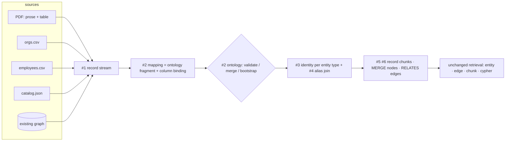

# Design: Structured Data Ingestion

**Status:** Proposed · **Tracking:** [FalkorDB/research#82][i82] (POC) · design from [research#65][i65] · supersedes [GraphRAG-SDK#74][i74]

[i82]: https://github.com/FalkorDB/research/issues/82
[i65]: https://github.com/FalkorDB/research/issues/65
[i74]: https://github.com/FalkorDB/GraphRAG-SDK/issues/74

---

## 1. Problem

`rag.ingest(...)` assumes one shape of input: a blob of prose.

```
load → chunk → lexical graph → LLM extract → prune → resolve → write → mentions → index
```

Structured inputs break three assumptions of that pipeline at once:

| Assumption (unstructured) | Reality (structured) |
| --- | --- |
| The schema is unknown and must be discovered by an LLM | The schema is already in the header row / JSON keys / source graph |
| Entity identity must be guessed from a surface string | Row identity is explicit and typed |
| Column values are prose to be re-described | Values are typed scalars that must survive as typed graph properties |

Today a mixed corpus (PDFs + a CRM export + a JSON catalog + a table lifted out of a PDF) needs a
bespoke loader per format, or pre-flattening to text — which discards exactly the structure that
made the source valuable, and spends an LLM call per row re-deriving what was already known.

### 1.1 The sources this must serve

The design has to hold for all of these at once, because a real corpus contains all of them:

1. **`employees.csv`** — one row = one `Person`, with an `org_id` foreign key.
2. **`orgs.csv`** — one row = one `Organization`. Different shape, different columns, same graph.
3. **`transactions.csv`** — one row = an *event between two entities*; the row is a fact, not a thing.
4. **A table lifted out of a PDF** — rows embedded in a document that also contains prose about
   the same entities. Table and prose must land in one connected subgraph.
5. **Nested JSON** — objects with sub-objects and arrays; the nesting *is* relationship structure.
6. **An existing graph** — nodes and edges already exist, possibly with their own ontology,
   possibly with none.

### 1.2 Invariants of the current SDK

Anything we design must respect what is already load-bearing, or retrieval silently degrades.
Each of these was verified against the code:

- **Every data edge is `RELATES` with a `rel_type` property**
  (`extraction_strategies/graph_extraction.py::_relations_to_relationships`). Edge vector search,
  `chunk_retrieval`'s neighbour expansion, and the text-to-Cypher prompt all assume it.
- **Node id = `compute_entity_id(name, label)`** → `"acme corp"` + `Organization` →
  `acme_corp__organization`. Nodes carry `__Entity__` plus their type label.
- **The lexical graph is mandatory.** `Document -[PART_OF]-> Chunk`,
  `Chunk -[NEXT_CHUNK]-> Chunk`, `Entity -[MENTIONED_IN]-> Chunk`. `update()` and
  `delete_document()` orphan cleanup is defined *entirely* over this chain
  (`delete_orphan_entities` matches `WHERE NOT (e)-[:MENTIONED_IN]->(:Chunk)`), and its
  correctness under concurrency depends on mentions being persisted before `pipeline.run()`
  returns.
- **`finalize()` embeds `Entity.name`** into the entity vector index (`backfill_entity_embeddings`
  selects `e.name`) and **`RELATES.fact`** into the edge vector index (`embed_relationships`
  filters `WHERE r.fact IS NOT NULL`). A node without `name` or an edge without `fact` is
  unreachable by vector search.
- **`delete_stale_relationships` garbage-collects edges via `RELATES.source_chunk_ids`.** An edge
  without that property is never cleaned up.

---

## 2. The design in one paragraph

**Reduce every structured source to a stream of flat records, and let one declarative mapping
turn records into typed nodes and `RELATES` edges.** The mapping is not a new schema language —
it *is* an ontology fragment plus a column binding, so declaring a mapping declares (or validates
against) the ontology. Identity is declared **once per entity type in the ontology**, not per
source, so differently-shaped CSVs, a PDF table, and a JSON file converge on the same nodes by
construction rather than by fuzzy post-hoc merging. Records are persisted as `Chunk` nodes in the
normal lexical graph, so provenance, `update()`, `delete_document()`, and all four retrieval
paths work on structured data with **zero changes to retrieval**. No LLM is called per row.

---

## 3. The proposals, in build order

Proposals **#1–#7 are the POC**. **#8–#12** are follow-ups.



---

### #1 — `RecordBatch`: one intermediate representation for all structured input

**What.** A single contract every structured source reduces to: a stream of flat
`dict[str, Any]` plus source metadata. It sits *next to* today's `LoaderStrategy`, not in
place of it.

```python
class RecordLoaderStrategy(ABC):
    async def load_records(self, source: str, ctx: Context) -> RecordBatch: ...

class RecordBatch(DataModel):
    records: Iterable[dict[str, Any]]   # streamed, never fully materialised
    document_info: DocumentInfo
    inferred_types: dict[str, str]      # column -> STRING/INTEGER/... hint from the reader
```

**Why.** Without it we get one bespoke code path per format — the exact problem #82 is filed
against. With it, a new format is a ~50-line loader and *nothing else changes*. It also dissolves
the two awkward sources:

- a **table inside a PDF** is a record stream whose `DocumentInfo` is the PDF's, so its rows
  become chunks of the *same* `Document` node as the prose — table and prose are connected before
  any entity resolution runs;
- an **existing graph** is *two* record streams (nodes and edges), because a graph is just a node
  table plus an edge table.

| Source | Records are |
| --- | --- |
| CSV / TSV / XLSX / Parquet | rows |
| JSONL | one object per line |
| nested JSON | a declared `record_path` (`$.orders[*]`); nested objects flatten to `customer.name`; nested arrays → `LIST` or child records |
| table in a PDF / DOCX | the table's rows, carrying the parent document + section |
| existing graph | node stream + edge stream |

---

### #2 — The mapping DSL, which doubles as an ontology fragment

**What.** `RecordMapping` / `NodeMapping` / `EdgeMapping`, plus `mapping.to_ontology()`.
Progressive disclosure — the 80% case is one line:

```python
# One row = one entity.
await rag.ingest("orgs.csv", mapping=Table(node="Organization", key="org_name"))
```

The general case is a denormalized row producing several nodes and the edges between them:

```python
mapping = RecordMapping(
    nodes=[
        NodeMapping(label="Person", key="employee_id", name="full_name",
                    properties={"age": "age", "title": "job_title"}),
        NodeMapping(label="Organization", key="org_id", name="org_name"),
    ],
    edges=[
        EdgeMapping(type="WORKS_AT", source="Person", target="Organization",
                    properties={"since": "start_date"}),
    ],
)
```

**Why it doubles as an ontology fragment.** A mapping already declares labels, typed properties
and relation patterns — that is literally the content of `Ontology`. So we do not invent a second
schema language; we project. This single fact is the whole answer to *"the existing graph may or
may not have an ontology"*:

| Graph state | Behaviour |
| --- | --- |
| Ontology exists, mapping is a subset | validate, proceed |
| Ontology exists, mapping adds labels / attributes | `Ontology.merge()` — the additive path `discovery` already uses |
| Ontology exists, mapping **contradicts** it (type mismatch on an existing attribute) | reject **before any write**, naming the offending `Label.attribute` |
| **No ontology** | the mapping **bootstraps** it — the graph becomes self-describing and text-to-Cypher immediately knows the typed columns |
| No ontology *and* no mapping | out of POC scope; later an inference layer proposes a *draft mapping* (see #11) |

**Three ways an edge arises**, all in the same DSL:

1. **Intra-record** — two `NodeMapping`s in one record (the example above).
2. **Foreign key** — the target is defined in *another* source. We `MERGE` a stub node now and
   enrich it when that source is ingested, so **ingest order does not matter**. This is what makes
   "many differently-shaped CSVs" workable.
3. **Nested containment** — a nested JSON object/array becomes a child node with a declared
   `rel_type` back to its parent.

`CsvMapping` / `JsonMapping` from #65 survive as thin format-flavoured constructors adding reader
options (delimiter, encoding, `record_path`).

**Reified events.** For `transactions.csv`, where the row *is* the fact, the row becomes a node
(`NodeMapping(label="Transaction", ...)`) with two edges out. Row-as-node vs. row-as-edge is the
mapping author's choice, not a format question; the rule of thumb is "does the fact have
properties, or need to be retrieved on its own?"

---

### #3 — Identity declared once on the entity type, not per source

This is the crux, and the thing that makes heterogeneous sources compose.

**What.** Add `identity` to the ontology entity type, defaulting to `name`:

```python
Entity(label="Organization", identity=["name"])   # default
Entity(label="Product",      identity=["sku"])    # a real cross-system business key
```

Node id becomes `compute_entity_id(<joined identity values>, label)` — **the same function the
unstructured path already uses.**

**Why.** Separate two things that are usually conflated:

- **Record key** (`NodeMapping.key`) — what makes *re-ingesting this source* idempotent.
  Source-local. Governs the record's chunk id and is stored as an indexed property.
- **Entity identity** — what makes the same real-world thing **one node across all sources**.

With identity declared on the *type*:

- a PDF mention of `Acme Corp` and a CSV row with `org_name="Acme Corp"` compute the **same id**
  and `MERGE` onto the **same node** — connected and traversable at write time, with no merge
  pass, no similarity threshold, and no LLM;
- differently-shaped CSVs converge because every mapping must supply the type's identity
  attributes — the *sources* differ, the *identity contract* does not;
- if identity were per-mapping, five sources would mean five identity opinions and a disconnected
  graph.

---

### #4 — `AliasMatchResolution`: the deterministic bridge for business-key identity

**What.** Structured writes store normalized alias handles on the node, built with
`compute_entity_id` so they are directly comparable to unstructured ids:

```
alias_ids: ["acme_corp__organization", "acme__organization"]   # indexed LIST
```

A new `ResolutionStrategy` merges an incoming node onto an existing node when its id appears in
that node's `alias_ids`.

**Why.** Unstructured extraction can only ever produce a **name** — it can never know an SKU. So
an entity type whose identity is *not* `name` would leave the PDF entity and the CSV row
disconnected. This bridges them, and it is:

- **deterministic and index-backed** — no LLM, no embeddings;
- **direction-agnostic** — works whether the CSV or the PDF was ingested first;
- **reusable** — because it implements the existing `ResolutionStrategy` ABC, it also works in
  the unstructured pipeline and inside `finalize()`.

Fuzzy merging (`SemanticResolution`, `LLMVerifiedResolution`, `deduplicate_entities()`) stays
available and unchanged, but is no longer on the critical path. **Make the common join exact;
keep the fuzzy one optional.**

---

### #5 — A record is persisted as a `Chunk`

**What.** Structured records go into the *normal* lexical graph:

- a `Document` node per source;
- one `Chunk` node per record, with `kind="record"`, the record key as a property, and text that
  is a human-readable rendering of the record
  (`"Alice Smith · age 34 · Engineer at Acme Corp"`);
- a **deterministic** chunk uid — `sha256(<effective document uid> + record_key)` instead of
  today's `uuid4()`;
- `MENTIONED_IN` edges from the record's entities to that chunk.

> **The chunk uid must be derived from the *run's* `DocumentInfo.uid`, never from the canonical
> document id.** During `update()` those differ: the pipeline runs against
> `pending_id = f"{resolved_id}__pending__{uuid4().hex[:8]}"`, and `rollforward_cutover()`
> step 1 calls `delete_document_chunks_and_node(real_id)` *before* promoting the pending. If
> record chunks were keyed on the canonical id, the pending run would `MERGE` onto the **same
> chunk nodes as the live document**, and the cutover would delete the chunks it is about to
> promote — silent data loss. Keying on the effective (pending) uid keeps the two chunk sets
> disjoint, exactly as the `uuid4()` behaviour does today.

**Why this is the highest-leverage decision in the list.** It looks small and it buys four things
we would otherwise have to build:

- **`update()` and `delete_document()` work unchanged.** Their cleanup is defined purely over
  `Document` / `Chunk` / `MENTIONED_IN` — verified: `delete_orphan_entities` matches
  `WHERE NOT (e)-[:MENTIONED_IN]->(:Chunk)`, and `get_document_entity_candidates` walks
  `(:__Entity__)-[:MENTIONED_IN]->(:Chunk)<-[:PART_OF]-(:Document)`. Structured data inherits
  correct incremental updates for free, including the concurrency invariant that mentions are
  written before `run()` returns.
- **Chunk retrieval finds rows.** A CSV of product descriptions is genuinely useful text; a
  question answered by "the row itself" works with no new retrieval path.
- **The PDF table connects to the PDF prose automatically** — same `Document`, adjacent chunks.
- **Zero-Loss Data holds** — the original record is recoverable from the graph.

**Idempotency.** Re-ingesting the same source via `ingest()` resolves to the same canonical
document id, so every record chunk uid is identical and the write rewrites the same nodes instead
of duplicating them. Combined with deterministic node ids (#3), the whole re-ingest is a
semantic no-op. Under `update()` the no-op guarantee comes from the existing **content-hash
short-circuit** instead — an unchanged file never reaches the pending-cutover path at all.

**Row-level incremental update (follow-up, not POC).** Deterministic uids make it *possible* to
diff record keys against the stored set and touch only rows that changed, instead of rebuilding
the whole document. But `update()`'s pending-cutover is whole-document by construction — its
pending id is randomised — so row-level diffing needs its own path that bypasses the cutover.
Tracked as an open question (§8.8), not part of the POC.

**Cost knob.** One embedding per record is unacceptable at 10M rows, so
`index_records="auto" | True | False`. `auto` embeds a record only when it carries a free-text
column above a length threshold; otherwise the chunk is still stored — provenance, `update()`
and traversal all intact — just not embedded.

---

### #6 — `StructuredIngestionPipeline`, sharing the load-bearing steps

**What.** A pipeline that deliberately mirrors the 9-step unstructured one, so the two are
explainable side by side. ♻ marks steps that are the *existing* implementation, factored into a
shared base — **not** copied.

| # | Step | Note |
| --- | --- | --- |
| 1 | Load records | streamed, bounded batches |
| 2 | Reconcile ontology | `mapping.to_ontology()` → validate / merge / bootstrap / reject |
| 3 | Lexical graph ♻ | `Document` + record `Chunk`s, deterministic uids, content hash |
| 4 | Map records → `GraphData` | pure function, **no LLM** |
| 5 | Coerce + validate types | ontology `Attribute.type` is the source of truth |
| 6 | Prune against ontology ♻ | reuse `IngestionPipeline._prune` verbatim |
| 7 | Resolve | `ExactMatchResolution` + `AliasMatchResolution` (#4) |
| 8 | Write ♻ | `MERGE` nodes; edges as **`RELATES` + `rel_type`** |
| 9 | Mentions + index ♻ | must complete before `run()` returns |

**Why share rather than copy.** Step 9's ordering is load-bearing for concurrent-update
correctness and already carries a boxed warning comment in `ingestion/pipeline.py`. Copying it
is precisely how that invariant gets silently broken later.

**Why `RELATES` + `rel_type` rather than a native `:WORKS_AT` edge.** Every retrieval path assumes
`RELATES`. A second edge convention would be a permanent tax on every retrieval strategy.

**Three properties structured writes must set** (verified against the storage layer — omitting
any one silently breaks a subsystem):

| Property | On | Consequence if omitted |
| --- | --- | --- |
| `name` | node | `backfill_entity_embeddings` falls back to the raw id → entity vector search degrades |
| `fact` | `RELATES` | `embed_relationships` filters `WHERE r.fact IS NOT NULL` → the edge is **never** embedded and is invisible to edge vector search |
| `source_chunk_ids` | `RELATES` | `delete_stale_relationships` can never garbage-collect the edge → stale facts survive `update()` forever |

**Type coercion** uses `Attribute.type` (`STRING` / `INTEGER` / `FLOAT` / `BOOLEAN` / `DATE` /
`LIST`), with `on_type_error="skip_value" | "skip_record" | "raise"` (default `skip_value`). The
failure **counts are part of `IngestionResult`**, not debug logging — silent coercion failure is
how structured ingestion quietly produces a garbage graph.

---

### #7 — One entry point

```python
await rag.ingest("report.pdf")                             # unstructured — unchanged
await rag.ingest("employees.csv", mapping=mapping)         # structured
await rag.ingest(records=[{...}], mapping=mapping)         # in-memory
await rag.update("employees.csv", mapping=mapping)         # same pipeline, incremental
await rag.ingest([("a.csv", m1), ("b.json", m2), "c.pdf"]) # mixed batch
```

Routing rule: **`mapping` present → structured path.** A structured file with *no* mapping keeps
today's text behaviour and logs an actionable hint.

**Why not auto-route on file extension.** A `.csv` sometimes genuinely *is* prose, and silently
changing what an existing call does is worse than one log line.

---

### #8 — Formats beyond CSV

JSON / JSONL (`record_path`, flattening, array policy), XLSX, Parquet. Each is a
`RecordLoaderStrategy` (#1) and touches nothing else. Optional dependencies stay lazy and
optional, matching the existing `pdf` / `markdown` extras:
`structured = ["pandas", "openpyxl", "pyarrow"]`. **CSV and JSON must work stdlib-only** — the POC
must not force a pandas install.

### #9 — PDF-table record stream

Feed tables detected by the document loaders into #1 as a record stream carrying the parent
`DocumentInfo`. This is where "a table inside a PDF" stops being a hand-written special case.

### #10 — Existing-graph import

A node stream plus an edge stream through the same mapping engine: `label` column → ontology
label, `id` column → identity attribute, edge `type` column → `rel_type`. If the source graph has
its own schema, a label map translates it; if not, labels are taken as observed and the ontology
is bootstrapped (#2). Live DB connectors stay out of scope (research#62).

### #11 — Mapping inference (opt-in, draft only)

`records -> RecordMapping`: propose labels from the file/sheet name, key from column uniqueness,
types from observed values — then the user confirms. Deliberately a separate layer whose *output
is a mapping*, so the execution engine stays fully deterministic. Extension of research#240.

### #12 — Property-conflict policy

Two sources will disagree about `Organization.employee_count`. POC policy:
`on_conflict="last_write_wins" | "keep_existing" | "record_both"`, defaulting to last-write-wins
with the winning source recorded in a `sources: LIST` property. Full per-property provenance is
deferred — it doubles write cost and the POC does not need it.

---

## 4. Coverage of the #82 acceptance criteria

| Criterion | Satisfied by |
| --- | --- |
| `ingest()` accepts a structured source + mapping, writes typed nodes/edges, no LLM per row | #2, #6, #7 |
| Re-ingesting the same source is a no-op | #3 (deterministic node ids) + #5 (deterministic chunk uids under `ingest()`; the existing content-hash short-circuit under `update()`) |
| Mixed PDF + CSV corpus produces one connected graph | #3 (shared identity) + #4 (alias bridge) + #5 (PDF table shares the `Document`) |
| Retrieval answers a question needing both | §5 — no retrieval changes required |
| Docs page + example | #7, plus `examples/11_structured_ingestion.py` |

---

## 5. Why retrieval needs no changes

This is the test of whether the ingestion design is correct.

| Retrieval path | Why structured data is already visible |
| --- | --- |
| Entity vector search | structured nodes carry `name`; `backfill_entity_embeddings` embeds it like any entity |
| `RELATES` edge vector search | structured edges are `RELATES` carrying a built `fact`; `embed_relationships` picks them up |
| Chunk vector + fulltext | record chunks are ordinary `Chunk` nodes (#5) |
| Text-to-Cypher | typed properties are in the ontology (#2), so the prompt advertises them; `rel_type` values come from `EdgeMapping.type` |
| Neighbour expansion | `chunk_retrieval` traverses `RELATES`, which structured edges are (#6) |

Not one retrieval strategy is touched.

---

## 6. Worked example — the acceptance scenario

```
acme_report.pdf   prose about Acme + an embedded revenue table
employees.csv     employee_id, full_name, age, job_title, org_id
orgs.csv          org_id, org_name, hq_country
```

```python
await rag.ingest("acme_report.pdf")                      # prose chunks + table rows, one Document

await rag.ingest("orgs.csv", mapping=RecordMapping(nodes=[
    NodeMapping(label="Organization", key="org_id", name="org_name",
                properties={"hq_country": "hq_country"}),
]))

await rag.ingest("employees.csv", mapping=RecordMapping(
    nodes=[
        NodeMapping(label="Person", key="employee_id", name="full_name",
                    properties={"age": "age", "title": "job_title"}),
        NodeMapping(label="Organization", key="org_id", reference=True),   # FK, not re-declared
    ],
    edges=[EdgeMapping(type="WORKS_AT", source="Person", target="Organization")],
))

await rag.finalize()
await rag.completion(
    "Which engineers work at the company whose report mentions a Q3 revenue miss?"
)
```

The traversal that answers it:

```
Chunk("Q3 revenue miss…")  <-[MENTIONED_IN]-  Organization(acme_corp__organization)
                                                        |
                                                        |  RELATES {rel_type: "WORKS_AT"}
                                                        |
                                              Person(alice_smith__person) {title: "Engineer"}
                                                        |
                                                        |  MENTIONED_IN
                                                        |
                                              Chunk(record: employees.csv row 41)
```

`Organization` is a **single node**: the PDF wrote it by name, `orgs.csv` wrote it by name
(identity defaults to `name`, #3), and `employees.csv` referenced it by foreign key and resolved
to the same identity. Nothing merged it after the fact.

---

## 7. Alternatives considered and rejected

| Alternative | Why rejected |
| --- | --- |
| Flatten rows to text and reuse the LLM pipeline | An LLM call per row; loses typing; non-deterministic identity — the exact status quo #82 is filed against |
| Native typed edges (`:WORKS_AT`) instead of `RELATES` + `rel_type` | Invisible to edge vector search, neighbour expansion and the text-to-Cypher prompt. A second edge convention taxes every retrieval strategy forever |
| Node id always = record key, merge with unstructured afterwards | The graph is only connected *after* a fuzzy `finalize()` pass. Fails "one connected graph" as an ingest-time property, and makes correctness depend on a similarity threshold |
| A separate `Record` node linked to a semantic entity node | Doubles node count and forces every retrieval path into a two-hop indirection |
| No lexical graph for structured data (typed nodes only) | Loses `update()` / `delete_document()`, loses chunk retrieval over rows, violates Zero-Loss. Cheaper to write, far more expensive to own |
| A separate `rag.ingest_structured()` entry point | Two entry points means two sets of ontology / config / validation semantics that drift |
| Per-mapping identity rules | Five sources → five identity opinions → a disconnected graph. Identity belongs to the entity type |
| Live DB connectors, OCR / images, HTML / MD stripping | Separate issues (research#62, #241, #258) |

---

## 8. Open questions

1. **`Entity.identity` is a new ontology field.** Persisted ontologies need a default/migration
   (`["name"]`). Confirm the ontology-store versioning story.
2. **Multi-column identity** — the join separator and normalization must be pinned so ids are
   stable across sources that order columns differently.
3. **`DATE` handling** — accepted input formats, and whether we store epoch, ISO string, or a
   native type.
4. **Arrays → `LIST` vs. exploding into child nodes** — needs a default and an override.
5. **Large-source `update()` ceiling — a real gap, not a hypothetical.**
   `GraphStore.get_document_entity_candidates()` returns the full `DISTINCT` entity set for a
   document in one round-trip with no `LIMIT`, and its docstring explicitly scopes out
   "documents with millions of distinct entities … would need a streaming/batched variant."
   A 1M-row CSV is exactly one `Document` with ~1M entities. So `update()` /
   `delete_document()` on a large structured source hits a documented scaling limit. Either the
   POC caps source size, or #5 needs a companion change to batch that call.
6. **POC scale target** — row count, and whether streaming writes need a dedicated batched path
   rather than materialising a `GraphData`.
7. **Existing-graph import depth (#10)** — is node-list + edge-list enough for the POC, or is
   GraphML / RDF expected?
8. **Row-level incremental update** — worth a dedicated path that bypasses `update()`'s
   whole-document pending-cutover, or is whole-document rebuild acceptable for the POC?

---

## 9. Design-review findings

The two central claims — *"retrieval needs no changes"* and *"orphan cleanup is unchanged"* —
were walked against the code before this document was published. Both hold, with three
concrete requirements and one gap that the walk surfaced:

| Finding | Where | Folded into |
| --- | --- | --- |
| Structured nodes must set `name`, and structured edges must set `fact` **and** `source_chunk_ids`, or entity embedding / edge embedding / stale-edge GC each silently break | `vector_store.backfill_entity_embeddings`, `vector_store.embed_relationships`, `graph_store.delete_stale_relationships` | #6, "three properties structured writes must set" |
| Record chunk uids keyed on the *canonical* document id would collide with the pending document's chunks during `update()`, and `rollforward_cutover()` would delete the chunks it is about to promote | `graph_store.rollforward_cutover`, `api/main.py::update` (`pending_id`) | #5, callout box |
| `get_document_entity_candidates()` has no `LIMIT` and explicitly scopes out documents with millions of entities — a large CSV is exactly that | `graph_store.get_document_entity_candidates` | §8.5 |
| Orphan cleanup is defined purely over `MENTIONED_IN` → `Chunk` → `PART_OF` → `Document`, so record-as-chunk inherits it unchanged | `graph_store.delete_orphan_entities` | #5 |

---

## Appendix A — Implementation phasing

| Phase | Contents |
| --- | --- |
| **P1 — skeleton** | `RecordLoaderStrategy` + `RecordBatch`, `CsvRecordLoader`, `RecordMapping` / `NodeMapping` / `EdgeMapping`, `mapping.to_ontology()` (#1, #2) |
| **P2 — pipeline** | Extract the shared lexical-graph / prune / write / mentions base out of `IngestionPipeline`; add `StructuredIngestionPipeline`; deterministic record chunk uids (#5, #6) |
| **P3 — identity** | `Entity.identity`, alias handles, `AliasMatchResolution` (#3, #4) |
| **P4 — formats** | JSON / JSONL / XLSX / Parquet; PDF-table record stream; node-list + edge-list graph import (#8, #9, #10) |
| **P5 — surface** | `ingest(mapping=...)` / `update(mapping=...)` routing, `IngestionResult` counters, `examples/11_structured_ingestion.py`, docs page, mixed-corpus integration test (#7) |

## Appendix B — Notes

- The example filename in #65 (`08_structured_ingestion.py`) is taken; `examples/` is already at
  `10_ontology_discovery.py`, so the new example is `11_structured_ingestion.py`.
- `GraphSchema` / `EntityType` / `PropertyType` in #65 are the pre-v1.2 names. This document uses
  the current `Ontology` / `Entity` / `Attribute` naming.
