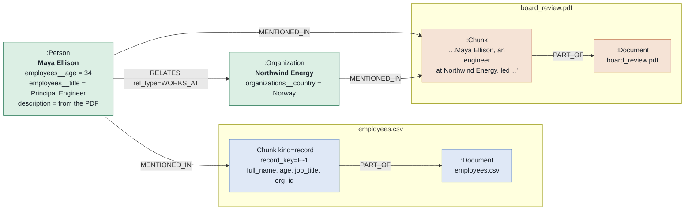

The extraction pipeline is built for prose: it chunks text, asks a model what the entities are, and describes them. Send a CSV through it and every cell arrives as a described entity, which loses the two properties a table has and a document does not — a stable key per row, and a known type per column. `age` becomes the string `"34"` if it survives at all, so nothing can be averaged, filtered numerically, or joined on a key.

Structured ingestion takes the other route. You declare what the columns mean — once, in the ontology, next to the entity types — and the SDK writes the graph deterministically, with no model in the loop:

```python
from graphrag_sdk import Column, Entity, GraphRAG, Link, Ontology, TableMapping

ONTOLOGY = Ontology(
    entities=[Entity(label="Person"), Entity(label="Organization")],
    tables=[
        TableMapping(
            source="employees.csv",
            label="Person",
            key="employee_id",
            name="full_name",
            properties={"age": Column("age", "INTEGER")},
            links=[Link("WORKS_AT", to="Organization", by="org_id")],
        ),
    ],
)

async with GraphRAG(connection=..., llm=..., embedder=..., ontology=ONTOLOGY) as rag:
    await rag.ingest("data/board_review.pdf")   # prose
    await rag.ingest("data/employees.csv")      # a table
    summary = await rag.finalize()
```

There is no `mapping` argument. A `.csv` is records, its declaration is already in the ontology, and `ingest` finds it by filename — so the call for a table looks exactly like the call for a PDF, and the two cannot disagree about how a file should be read.

The same input always produces the same graph, because identity comes from a declared key and every type is declared rather than inferred.

---

## Mental Model

A structured source produces exactly the same shapes as a document, so both halves of a graph are queryable the same way:

| Label       | One per                | Notes                                                                 |
| ----------- | ---------------------- | --------------------------------------------------------------------- |
| `Document`  | source file            | Addressed by `document_id`, which defaults to the table's name: the basename of the mapping's `source`. |
| `Chunk`     | **record**             | `kind: "record"`, plus `record_key` and every cell of the row.        |
| `__Entity__`| mapped node            | Typed properties from the declared columns, each signed with its source. |

A record is a chunk. That is the whole trick: a row becomes retrievable and traceable to its source in exactly the way a paragraph is, while the typed projection lives on the entity where aggregation reads it.

### What it looks like on the graph

Two sources describing one person — `employees.csv` and a board-review PDF — produce this shape. Every node and edge below is real: it was read back from FalkorDB after the two files were ingested.



One `:Person`, mentioned by a record chunk **and** a prose chunk. The row's cells live on the chunk under their own column names; the typed, signed projection lives on the entity. The `WORKS_AT` edge came from the CSV's `Link`; nothing in the PDF had to say it.

#### One node, as the FalkorDB browser shows it

Click `Maya Ellison` in the browser at `http://localhost:3000` and this is the property panel. Annotations on the right are not in the graph; everything else is verbatim.

| Property | Value | Written by |
| --- | --- | --- |
| `id` | `maya_ellison__person` | the SDK, from the **name** — the same derivation a prose mention gets, so the two halves share an id outright |
| `name` | `Maya Ellison` | `employees.csv`, from `name="full_name"` |
| `employees__employee_id` | `E-1` | `employees.csv` — the key, **signed** |
| `employees__age` | `34` | `employees.csv` — typed `INTEGER`, **signed** |
| `employees__title` | `Principal Engineer` | `employees.csv`, **signed** |
| `is_stub` | `false` | the SDK: this row's own source has arrived |
| `entity_key` | `E-1` | the SDK: the value this row is keyed by, unsigned — what links and re-sync resolve through |
| `description` | `Maya Ellison is an engineer at Northwind Energy who led the preparation of the remediation plan…` | **the PDF** — unsigned, so it can never collide with a column |
| `source_chunk_ids`, `spans` | `[…]` | the SDK: which chunks mention her and where |
| `embedding` | `<256 floats>` | `finalize()` |

Read the signatures and the provenance is on the node itself. Anything `employees__` came from that file and only that file. Anything unsigned came from prose or from the SDK. There is no third possibility, which is why a table and a document cannot overwrite each other.

#### The node a foreign key created before its source arrived

`employees.csv` pointed at `ORG-NW` two steps before `organizations.csv` named it. This is that organization afterwards:

| Property | Value | Written by |
| --- | --- | --- |
| `id` | `northwind_energy__organization` | the SDK, from the name. The placeholder was created at `org-nw__organization` (the name was not known yet) and **renamed in place** when `organizations.csv` arrived — its edges came with it |
| `employees__org_id` | `ORG-NW` | `employees.csv` — the **pointer's** signed key, written when the placeholder was created |
| `organizations__org_id` | `ORG-NW` | `organizations.csv` — the **owner's** signed key, written when it arrived |
| `organizations__country` | `Norway` | `organizations.csv` |
| `name` | `Northwind Energy` | `organizations.csv` — the placeholder was named `ORG-NW` until then |
| `entity_key` | `ORG-NW` | the SDK: how `organizations.csv` found the placeholder `employees.csv` had raised |
| `is_stub` | `false` | flipped when the owning source landed |
| `description` | `Northwind Energy is an organization that…` | the PDFs |

Both signed keys on one node is the proof that the forward pointer and the owning source met, rather than producing two organizations. It is also the exact assertion the regression test for this makes.

#### See it yourself

```cypher
// every entity, with where its properties came from
MATCH (e:__Entity__)
RETURN e.name, [k IN keys(e) WHERE k CONTAINS '__'] AS signed, coalesce(e.description, '') <> '' AS from_prose
ORDER BY e.name

// a person, the row that produced her, and the page that mentions her
MATCH (p:Person {name: 'Maya Ellison'})-[:MENTIONED_IN]->(c:Chunk)<-[:PART_OF]-(d:Document)
RETURN d.id, c.kind, c.record_key

// the edges a CSV Link created, with the signed value they carry
MATCH (p:Person)-[r:RELATES]->(o:Organization)
WHERE r.rel_type = 'WORKS_AT'
RETURN p.name, p.employees__age, o.name, o.organizations__country
```

<Note>
Records are **not** chained with `NEXT_CHUNK`. Rows have no reading order, and text-to-Cypher is told `NEXT_CHUNK` means "the next sequential chunk", so chaining unrelated rows would assert a sequence that does not exist.
</Note>

<Warning>
Record chunks are **not embedded**, so a row is not reachable by chunk vector search. Rows are reached through their entities and through generated Cypher, which is what the typed columns exist for. This keeps a million-row table from becoming a million embeddings, and it means a question answerable only from a row's prose rendering will not find it.
</Warning>

---

## Declaring a Mapping

One form, `TableMapping`, and it lives in `Ontology.tables` rather than at a call
site. A mapping is part of the schema: the labels and column types it declares
have to be registered *before* any prose is extracted, or the extractor guesses a
label from a built-in list and the table's rows can never join what it produced.

Each record becomes one entity, plus an edge for every column that points at
something else.

### A table that describes one thing

`source` is the file name, which is what `ingest` matches on. Everything in
`properties` becomes a graph property: a bare string means `STRING`, wrap it in
`Column` to declare a type.

```python
from graphrag_sdk import Column, TableMapping

ORGS = TableMapping(
    source="orgs.csv",       # the file this maps, matched on its basename
    label="Organization",    # what each record becomes
    key="org_id",            # the column identifying it
    name="org_name",         # the column holding its display name
    properties={
        "hq_country": "hq_country",
        "employee_count": Column("employee_count", "INTEGER"),
    },
)
```

`key` is optional. It is declared here because the next table links into organizations by `org_id`, so the pointer column has to match something. A table nothing links into, whose names are unique, needs only `name=` — the name is then the identity, and the node id is exactly the one prose extraction computes for the same name.

### A table with a foreign key

An HR export is not one thing. It is a person, the company they work for, and
the employment between them. The `org_id` column is not text, it is an edge, and
`links` is how you say so:

```python
from graphrag_sdk import Link

EMPLOYEES = TableMapping(
    source="employees.csv",
    label="Person",
    key="employee_id",
    name="full_name",
    properties={
        "age": Column("age", "INTEGER"),
        "title": Column("job_title"),
    },
    links=[Link("WORKS_AT", to="Organization", by="org_id")],
)
```

Note what did **not** happen: adding a link is an extra argument, not a rewrite.
The declaration you started with is still there. Both mappings then go in one
place:

```python
ONTOLOGY = Ontology(
    entities=[Entity(label="Person"), Entity(label="Organization")],
    tables=[ORGS, EMPLOYEES],
)
```

A `Link` can also carry the target's name, when the row denormalises it, and
properties of its own:

```python
Link("WORKS_AT", to="Organization", by="org_id",
     name="org_name",                                  # names the target
     properties={"since": Column("start_date", "DATE")})  # goes on the edge
```

### What the fields mean

| Field       | Meaning                                                                                                                                                 |
| ----------- | ------------------------------------------------------------------------------------------------------------------------------------------------------- |
| `source`    | The file this mapping describes, matched on its basename. It is also the property **signature** — see [Who Owns a Column](#who-owns-a-column).            |
| `label`     | The label each record becomes.                                                                                                                          |
| `name`      | The display name column — what a person, and a document, calls this thing. It is what joins a row to a mention in prose (see [Bridging](#bridging-the-two-halves)), and, unless `key` is given, it is also the row's identity. |
| `key`       | **Optional.** The column that identifies the row when that is *not* the name. Defaults to `name`, and for most tables that is right: the node id is then exactly what prose extraction computes for the same name, so the two halves share an id outright. Declare a separate key when names can repeat (two John Smiths), when a name can change while the row persists (a rename), or when other tables `Link` into this one by an id column rather than by name. Must be unique per row either way: see below. |
| `properties`| `{property_name: Column}`, or a bare string for `STRING`. Declared types are enforced at ingest, so a bad cell fails the ingest instead of writing a wrong type. |
| `links`     | Columns that point at other entities. Each becomes a reference node plus an edge. A pointer creates the target if it is missing and only **adds its key** if it is there, so it can never overwrite real data. That is what makes the order of two files irrelevant. Two links to the same label are kept apart automatically. |
| `standalone`| Says out loud that a new label genuinely relates to nothing, so an unconnected island is something you declared rather than something a typo produced. Only meaningful when the label is new and there are no links. |

Column types: `STRING`, `INTEGER`, `FLOAT`, `BOOLEAN`, `DATE`, `LIST`.

A declared type is enforced when the source is read, so a cell that does not hold
it fails the ingest instead of writing a wrong type. `FLOAT` also rejects `nan`
and `inf`: they are valid float literals and one of them turns an `avg()` over the
whole column into `NaN` with nothing in the result to point at the cause. `LIST`
is parsed as a CSV row, so a quoted element may contain a comma.

<Note>
A mapping can name any label it likes. If it declares one the ontology does not
have while other labels already hold entities, the SDK logs which ones and how
many — a new label is ordinary on a fresh graph, but a second label for a kind of
thing that already exists cannot be joined by resolution, so one real person ends
up held as two nodes with the facts split between them.
</Note>

### Numbers, and the comma

A comma means opposite things either side of the Atlantic, so `INTEGER` and
`FLOAT` decide the cases that are decidable and refuse the one that is not:

| Cell | Read as | Why |
| ---- | ------- | --- |
| `1,234.56` | `1234.56` | both separators, so the rightmost is the decimal point |
| `1.234,56` | `1234.56` | same rule, German convention |
| `880,5` | `880.5` | one comma, not followed by three digits: a decimal comma |
| `1,234,567` | `1234567` | more than one group of exactly three: grouping |
| `12 345,6` | `12345.6` | spaces and non-breaking spaces are grouping |
| `1,234` | **refused** | `FLOAT` only: one thousand, or one-point-two-three-four? Nothing says |
| `1,234` | `1234` | `INTEGER`: no fractional part is on offer, so grouping is the only reading |

The refusal names both readings. If your export uses that form, clean the column
or declare it `STRING` and convert it yourself. Earlier versions stripped every
comma, so a German export's `880,5` was stored as `8805.0` — every figure in the
column out by a factor of ten, with nothing raised.

Property names and relationship types must be identifiers — letters, digits and
underscores, not starting with a digit — because generated Cypher writes them as
bare names. When a source column is awkward, name the property and point it at
the column:

```python
properties={"hq_country": Column("HQ Country")}
```

Labels are quoted on write, so `Legal Entity` and `Org-Unit` are fine.

### Columns the SDK renames

A *property* name you declare must be an identifier, as above. A *column* name is
whatever the exporting system wrote, and two kinds cannot be used verbatim as a
graph property: names the SDK owns (`id`, `name`, `description`, …) and names that
are not identifiers (`HQ Country`, `Revenue (M USD)`). Those are stored under a
`col_` name instead:

| Column | Stored as |
| ------ | --------- |
| `employee_id` | `employee_id` — an identifier the SDK does not own, unchanged |
| `HQ Country` | `col_hq_country` |
| `Revenue (M USD)` | `col_revenue_m_usd` |
| `id` | `col_id` |

This applies to the `key=` column and to the per-cell properties of a record
chunk, so `key="id"` is safe to declare — the value lands on `col_id` and the
node keeps its own `id`. It reaches the ontology under the stored name too, with
the original header in the description, so generated Cypher can address it. On an
entity the stored name is then signed like any other, so `HQ Country` from
`orgs.csv` is `orgs__col_hq_country`.

<Note>
`key="id"` used to overwrite the node's graph id, which cost every row of that
table its `MENTIONED_IN` edges — no provenance and no way to join to prose — on a
load that reported success. A header containing a space reached the driver inside
a parameter map and surfaced as `DatabaseError: Invalid input at end of input`,
from a query the caller never wrote.
</Note>

<Warning>
`name` is not a mappable property — it has its own `name=` slot. Declaring it as an ontology attribute lets the extractor answer it with a null for prose mentions and blank out the display name of everything it extracts. The same applies to `id`, `type`, `description`, `source_chunk_ids`, `spans`, `embedding`, `entity_key`, and `is_stub`, all of which the SDK writes itself.
</Warning>

### When the key is not unique

Every row becomes its own chunk regardless, so no cells are lost. But the key
identifies the *entity*, so rows sharing one describe a single entity and only one
row's values end up on it. Which one is not defined. That usually means the wrong
column was declared as the key, so it is logged as a warning naming the column and
the repeated values.

### When a row has no key

A row whose key cell is blank has no stable identity, so it could never be updated
or deleted later, and it is not loaded. The result says so:

```python
result = await rag.ingest("employees.csv")
result.rows_in_source   # 4  — what the file held
result.rows_skipped     # 1  — what had no key
result.records          # 3  — what was written
```

`rows_skipped` and `rows_in_source` appear in `as_dict()` only when something was
skipped, and a skip is also logged as a warning naming the column and the row
numbers. This matters more on a re-sync than a first load: a key cell that goes
blank in a regenerated export makes the row vanish from the new snapshot, so the
update deletes its chunk and its entity.

<Note>
This used to be invisible. A four-row file with one blank key reported
`records: 3` — a true statement about what was written and a false one about what
the file said, with nothing in the result to tell the two apart.
</Note>

### What a link writes

A row in `employees.csv` says the organization exists and gives its key. It does not know the organization's name or headcount, and a `Link` writes that honestly:

- The target is created if it is missing; if it is there already — a row of another table, or an entity a document mentioned — the pointer adds only its key. It never overwrites what the owning source supplied.
- It carries its key, so it is joinable by the same column the mapping declared, whichever source created the node.
- It is flagged `is_stub: true` until the source that owns the entity arrives and fills it in.
- The edge is a `RELATES` edge carrying the link's `type` as its `rel_type`, which is how every data edge is stored.
- The edge's own declared properties are signed with the declaring source, with no exemptions at all — `since` on `WORKS_AT` from `employees.csv` is `employees__since`.
- One key is one node, however many columns of the file point at it. A citations table whose `citing` column carries an arXiv id and whose `cited` column carries the id plus a `name="title"` raises **one** placeholder for a paper both columns mention, named by the title; a `manager_id` pointing at rows of the same file lands on those rows, not on a placeholder beside them.
- Keys are compared stripped of surrounding whitespace. `ORG-NW ` in one export and `ORG-NW` in another are the same key; case is kept as written.

Order does not matter. Whichever source arrives first creates the node, and a
`Link` to a label that has not arrived yet is not a problem to be sequenced
around.

<Note>
A stub nothing ever filled in is reported by `finalize()` as
`unresolved_references`, per label. The graph looks complete until a question
needs the target's columns, so it is worth reading: either the owning export was
never loaded, or the keys do not match.
</Note>

---

## A table is never read as prose by accident

Dispatch is by **file extension**, not by an argument. `.csv`, `.tsv`, `.psv` and
`.tab` take the deterministic record path; everything else takes the text path.
Nothing about the call site can change that, so a table cannot be sent through the
extractor by forgetting something.

What the text path would do to a table is the reason: the whole file becomes one
chunk with its commas intact, an extractor pulls out whatever it happens to
notice, and no column keeps its type. Measured on a two-row export: one entity
written, `age` absent entirely, nothing raised.

### A table with no declared mapping

Nothing is refused. A table nobody mapped still belongs in the graph, so the SDK
**proposes a mapping** — one model call for the whole table, never one per row:

```python
result = await rag.ingest("employees.csv")   # nothing declared for it
```

The model is shown what was *measured* — every column with its type, fill and
uniqueness over the whole file, the first rows — and what the graph already holds:
the labels in use with their entity counts and descriptions, the relationship
types, the tables already mapped and their key columns. It answers the one thing
measurement cannot
settle, which is what a row is *about*: the label, the name column, the key, the
type of every other column, and which columns are links to other entities. The
descriptions are what let it tell a grants table from an experiments table when
both have a title, a lead and a start date — so a label you declare is worth
describing.

Everything it says about the data is then held to the data. A key it picks must be
unique and complete; a column it names must exist; a link must point at a label
the graph knows. A claim that does not hold goes back to the model with the exact
reason, up to two more times. A type it narrows past what the file holds — `INTEGER`
for a column with an `"N/A"` in it — is widened back to the measured type without a
retry, because that is a fact about the file rather than a judgement. A column it
leaves out is kept at its measured type, so no data is silently lost.

The proposal is stored in the ontology as `derived`, so every later load of the
table uses it without asking again, and a WARNING says what was chosen:

```text
No table mapping is declared for employees.csv, so it was proposed by the model:
label 'Person', name 'full_name', key 'employee_id', links WORKS_AT->Organization by
org_id. finalize() reports it under proposed_mappings. Declare a
TableMapping(source='employees.csv', ...) in the ontology to replace it, or
drop_table('employees.csv') to remove it.
```

`finalize()` reports it too, so it is visible after the fact rather than only in a
log:

```python
summary = await rag.finalize()
summary.proposed_mappings   # ["employees.csv"]
```

You have two moves. **Change it** by declaring a `TableMapping` for the source in
the ontology and ingesting again — the declaration replaces the proposal, however
the path is spelled, and the load is a re-sync of the same table. **Remove it** with
`drop_table()`:

```python
await rag.drop_table("employees.csv")
```

which deletes the table's Document and record chunks (and any entity only those rows
mentioned), removes every property the table signed from entities that survive, and
takes the mapping out of the ontology, so the next `ingest()` of that filename
proposes afresh. The label stays, because a document or another table may use it;
`drop_entity()` removes a label nothing else does.

Without a model, or when it cannot produce an acceptable proposal, the file is read
**as-is**: every column a typed property, the label from the file name in the file's
own casing (`readings`, not `Readings`), the key the leftmost column that is unique
and complete, and **no name column, so it joins nothing** — a wrong guess about
identity would attach rows to the wrong entities, and the rows land queryable and
unreachable from any document instead. It is reported under `proposed_mappings` the
same way. A file with no unique-and-complete column at all is refused, because a
row with no stable identity could never be updated or deleted later:

```text
MappingError: readings.csv has no column that is unique and complete, so no row
can be given a stable identity. Declare a mapping naming the key, or add an id
column to the export.
```

### Prose that happens to live in columns

The escape is real and worth knowing: a table of support tickets, survey answers
or meeting notes is prose that happens to live in columns, and its text should be
chunked and extracted. Passing a loader says so, and takes the file off the record
path:

```python
from graphrag_sdk import TextLoader

await rag.ingest("tickets.csv", loader=TextLoader())
```

<Warning>
The choice is per **file**, not per column. A mapping never extracts from text, so
a source like `ticket_id, customer, body` either keeps its typed identity and
loses whatever `body` mentions, or gets the entities from `body` and loses the
identity and the link. Marking a column as prose within a mapping is not built.
</Warning>

<Note>
`chunker` and `extractor` do not apply to a record source and are refused rather
than ignored, since neither has anything to do on a path that calls no model. A
table inside a list passed to `ingest([...])` is refused too: each structured
source is written on its own so that one bad row cannot fail the batch, so ingest
them one at a time.
</Note>

---

## Validation

The mapping is checked against the source's real header **before anything is written**, so a mapping that does not fit raises `MappingError` and leaves the graph untouched:

```text
MappingError: mapping does not fit employees.csv:
  node 'Person': property 'age' reads missing column 'age'
  node 'Organization': key column 'org_id' is not in the source
```

Pass `strict_mapping=True` to `ingest` to also reject a source with a column the mapping never reads. It is off by default because ignoring a column is a legitimate choice; turn it on where a dropped column would be a mistake rather than an omission.

---

## The Ontology

A mapping projects into the ontology, and this is what makes the columns queryable:

```python
ontology = await rag.get_ontology()
# Person: employees__employee_id:STRING, employees__age:INTEGER,
#         employees__title:STRING, employees__start_date:DATE
# WORKS_AT: [('Person', 'Organization')]
```

Without it, generated Cypher cannot see that `age` is a number and falls back to guessing that everything is a described entity. With it, aggregation questions become answerable.

Registration is **additive**. A label a previous source already declared is extended through the ontology-evolution primitives rather than redeclared, so prose can create `Organization` with only a name and a description and `orgs.csv` can later add `employee_count` as an `INTEGER` to the same label. Because each source signs its own properties, two tables describing one label cannot contradict each other at all. What still raises is a source contradicting *itself*: re-declaring one of its own columns with a different type is refused, and names `drop_attribute()` then `add_attribute()` as the deliberate way to change it.

A mapping is also authoritative about its own shape, so a property it stops declaring leaves the nodes as well as the schema — otherwise last week's value sits there looking current. Signed names make that drop exactly right: only `orgs.csv` can ever have written `orgs__hq_country`, so removing it cannot touch another source's data. `finalize()` reports the sources whose stored declaration changed in `mapping_changed`, so an edit made carelessly does not pass unnoticed.

---

## Keeping a Table in Sync

A table is a snapshot, not an addition, so ingesting a source that is already in the graph re-syncs it rather than writing over the top. There is no separate call — it is the same `ingest`:

```python
await rag.ingest("employees.csv")   # first write
# ... the export is regenerated, with one row corrected, one added, one gone ...
result = await rag.ingest("employees.csv")   # re-sync
result.entities_deleted   # 1 — the row that disappeared took its entity with it
```

Three kinds of change, and only one of them needs machinery:

| Change | What happens |
| ------ | ------------ |
| A row's values changed | Its node id comes from the declared key, so it rewrites itself in place. |
| A row was added | It simply arrives. |
| A row was **deleted** | Nothing is left to rewrite it. The re-sync is what removes it. |

The third case is why this path exists. The new records are written under a pending Document and swapped in atomically, so a departed row has no new chunk, the cutover deletes its old one, and its entity goes too **unless another source still mentions it**. Cleanup is scoped, never global: if `employees.csv` still points at `ORG-7`, dropping that organization from `orgs.csv` leaves the node alone.

A node that survives that way stops being the table's row, though. The re-sync takes back what the table signed on it — its typed columns, its key column, and the `entity_key`/`is_stub` those justified — the same way `drop_table()` does for a whole table, so an organization that left `orgs.csv` but is still pointed at by `employees.csv` reads as that table's placeholder again, and a person a memo mentions keeps the memo's facts and none of the export's. The same holds inside a row that stays: a cell that is blank in the new export removes its column from the node rather than keeping last export's value.

<Note>
The re-sync short-circuits when nothing changed: an unchanged source returns `no_op=True` without writing. The content hash covers the **mapping** as well as the rows, so changing a declared type or adding a column re-writes the source instead of being mistaken for unchanged data.
</Note>

A document remembers how it was written, and nothing may change its mind: re-reading a CSV as prose would replace its record chunks with one text chunk and take every entity with them. So `update()` refuses to change a document's kind — a `.csv` cannot be updated as prose, nor a text document as records — while a table in `apply_changes(modified=[...])` is re-synced through its stored mapping like any other `update()`.

A table is addressed by its **name** — the basename of its mapping's `source`, `employees.csv` — unless you pass `document_id`. A document is addressed by its path because the path is all there is to know about it; a table has a declaration, and exports move. Keyed on the path, `/exports/2026-02/hr.csv` was a second Document under the same label with January's left behind reading as current; keyed on the name, a new export of a known table is a re-sync of it, from wherever it arrives. Use the same handle for `update()`, `delete_document()` and `drop_table()`.

<Warning>
The retraction above runs inside the re-sync, `delete_document()` and `drop_table()`.
`finalize()` still checks for signed values left on an entity by a source that no
longer mentions it — a graph written before the retraction existed, or a cleanup
interrupted before it ran — and reports them as `stale_signed_properties` rather than
removing them: the graph cannot tell "that source dropped the row" from "that source
has not been reloaded yet", and guessing would delete live data. Non-empty means
re-load the named source, or accept that those values are historical.
</Warning>

---

## Scale

Measured on a laptop against a local FalkorDB, one CSV of employees with five
columns, each row producing a `Person`, a reference to an `Organization`, a
`WORKS_AT` edge and a record chunk:

| Rows | Ingest | Throughput | Peak memory | Unchanged re-sync |
| ---- | ------ | ---------- | ----------- | ----------------- |
| 1,000 | 0.3s | ~3,000 rows/s | 95 MB | 0.01s |
| 10,000 | 3.6s | ~2,800 rows/s | 152 MB | 0.04s |
| 25,000 | 14.4s | ~1,700 rows/s | 248 MB | 0.11s |
| 50,000 | 38.5s | ~1,300 rows/s | 408 MB | 0.20s |

Memory grows with the row count: the whole file's chunks, nodes and edges are
held before anything is written, which is what makes a failed load leave the graph
untouched. The measured cost is roughly 6.5 KB per row. Growth in time is close to
linear but not quite, so a very large table is slower per row than a small one.
Re-syncing a source whose rows have not changed is a hash comparison, independent
of size.

No model is called at any point on this path, so the cost is graph writes and
nothing else. A prose document of the same size would be dominated by extraction.

---

## Who Owns a Column

Every source does, and the property name says which. A mapping's `source` is also
its **signature** — the file name with the directory and one extension removed —
and every property it writes is stored as `<signature>__<property>`:

```
employees.csv   age              →  Person.employees__age
organizations.csv   country      →  Organization.organizations__country
employees.csv   WORKS_AT.since   →  employees__since   (on the edge)
```

`id`, `name`, `entity_key` and `is_stub` stay unsigned, because the SDK owns them
and they are the join: an extracted node and a keyed node have to meet on the
name. Edge properties have no such join, so **nothing on an edge is exempt** —
which also puts `rel_type`, `fact` and `source_chunk_ids` permanently out of a
declaration's reach rather than merely discouraging them.

Two things follow, and they are the point:

**Two tables writing one property cannot overwrite each other.** `hr.csv` and
`finance.csv` both declaring `grade` write `hr__grade` and `finance__grade`.
Before signing, whichever loaded last won and the loser's value was gone from the
graph with nothing reported — measured on edge properties too, where both tables
declared `WORKS_AT.since`.

**A prose-extracted property cannot collide with a declared one at all.** Anything
the extractor decides is unsigned by construction, so it lands under its own name
beside the signed one. That is structural, not a guard: a job title arriving
lowercased from a memo has nowhere to overwrite the `"Engineer"` the HR export
spelled.

The cost is that hand-written Cypher has to say `p.employees__age`:

```python
rows = await rag.query(
    "MATCH (p:Person) RETURN avg(p.employees__age) AS mean_age"
)
```

Text-to-Cypher handles it without being told, because each `Attribute`'s
description names the source column and the table it came from — `age, from table
employees` — so "what is the average age" still generates the right property.
Unsigned schema handed to the same path instead looked for an entity named
`finance` and answered wrongly.

### A conflict is kept, never resolved

Two sources disagreeing about one thing is not a failure and nothing is lost.
Both values stay on the node under their own signatures, neither source is
preferred, and there is deliberately no precedence rule. `finalize()` reports it,
because it is also the thing that makes a question ambiguous — asked for "the
grade", a query has to pick a source, and it will pick one silently:

```python
summary = await rag.finalize()
summary.property_conflicts
# ["Person.grade — supplied by finance.csv, hr.csv"]
```

That is how you find out there is a disagreement to go and settle at the source.

### Two files, one signature, refused

The signature is derived, and deliberately not injective: `hr.csv`, `HR.CSV` and
`hr csv.csv` all reduce to `hr`. Two sources that reduce alike would share one
property namespace and silently overwrite each other, so the collision is refused
where every mapping is visible at once, naming both paths:

```text
'/exports/2026-02/hr.csv' and the already-registered '/exports/2026-01/hr.csv'
both reduce to the property signature 'hr'. […] The signature is the file's
basename, so give one of them a distinct filename (for example hr_2026_02.csv).
```

This holds across sessions as well as within one ontology: the check runs against
what is already stored, before the first write, so the graph stays loadable and
the caller gets the error instead of a `GraphRAG` that cannot start on that graph
at all. One of the two files has to be renamed.

---

## Bridging the Two Halves

Documents and tables describing the same thing must land on one node, or neither half can answer a question that needs the other's facts.

The bridge is the **name**. An entity's id is derived from its name in exactly the same way whether it came from a row or a sentence, so two sources that spell a name identically produce the **same id** and are one node from the first write — no merge step involved:

```
employees.csv row  →  Person  name: "Alice Smith"   id: alice_smith__person
board_note.txt     →  Person  name: "Alice Smith"   id: alice_smith__person
                                                        ^^^^^^^^^^^^^^^^^^^ the same node
```

The row's key is not the identity. It is carried as `entity_key`, and it is what two things resolve through: a `Link` whose target has not loaded yet (a placeholder is created and later **renamed in place** onto the name-derived id when the owning source arrives), and a re-sync in which a row's name changed (the node written last time is moved to its new id rather than orphaned with its prose description). Two rows sharing a name would collapse into one entity, so those fall back to the key and are reported — and a prose mention of that name joins neither, correctly, because it is ambiguous.

The same caution runs the other way. `entity_key` is one unsigned slot, so two tables that both number `Person` from 1 leave two nodes carrying `entity_key = "1"`, and a third table's foreign key `1` cannot say which it means. That link is left on a placeholder that says only "Person keyed 1" and reported in `StructuredIngestionResult.references_ambiguous`, rather than attached to whichever node the graph listed last. Give the tables distinct key spaces, or key the link on a column only one of them owns.

What `finalize()` still does is handle **spelling variants**: `NORTHWIND ENERGY` from a NER model and `Northwind Energy` from a CSV are different strings and so different ids. It groups every entity by `(canonical name, label)` and merges each group. The canonical form is reduced independently on both sides — lower-cased,
punctuation split, `Surname, Given` un-inverted, abbreviations expanded, one
trailing legal form dropped — so the join is an equality rather than a pairwise
comparison and the order two sources arrive in does not change what merges. Word
order is deliberately preserved: sorting the tokens would wrongly merge `Stanley
Morgan` with `Morgan Stanley`, a person and a bank, and a merge is not reversible.

Because the match is on the name, a table whose display names are spelled differently from the prose will not join: `Maya Ellison` and `M. Ellison` stay two nodes, one holding her age and the other holding what she did. No canonical form can unify an initial with a full given name without also merging every other M-surname person, so those are **reported, never merged**:

```python
summary = await rag.finalize()
summary.probable_duplicates   # names that look like one thing and did not merge
```

Reported rather than merged on a guess, because a merge in the graph cannot be undone. There are two ways to close such a pair. The first is the spelling in the source, which fixes it for good. The second is the resolver.

### The resolver judges across sources

Within one document, `LLMVerifiedResolution` already decides this kind of pair: it embeds the names, and for the close ones asks the model whether they denote one thing, with each entity's description and relationships as evidence. What it never got was the chance to see a table's row and a document's mention together — they arrive in different `ingest` calls. `finalize()` gives it that chance: by default it builds an `LLMVerifiedResolution` over the instance's own `llm` and `embedder` and shows it the whole graph.

```python
await rag.ingest("employees.csv")                                   # Priya Raman, 39
await rag.ingest(text=MARKET_NOTE, document_id="market_note.txt")   # "Ms. Raman said…"
summary = await rag.finalize()
summary.resolved_duplicates   # ["Person 'Ms. Raman' -> 'Priya Raman'"]
```

The split of responsibilities is deliberate. The resolver decides **identity**, exactly as it does within a document. The merge follows the table's rules: the row's node survives, because its id is the one the next re-sync recomputes; every value the table signed onto it stays; the mention's description, chunks and relationships move onto it. Two rows of one table are never merged into each other whatever the resolver says — a declared key has already said they are two things — and a pair under two labels is left to the collision report. A row has no prose description, so the resolver is shown its signed values instead: `employees: employee_id E-3, age 39, title Head of Regulatory`.

The default is tuned for this job. Names across sources differ more than names within one document — an honorific for a first name, a short form for a full one — and with `text-embedding-3-small` "Ms. Raman" against "Priya Raman" scores 0.70, below the within-document `soft_threshold` of 0.80, so at that setting the model would never be asked. `finalize()`'s resolver starts asking at 0.6. The threshold only changes which pairs the model is asked about; it still decides each one, and a **NO** leaves both nodes in place. To use different thresholds, a different model, or a strategy of your own, pass it: `finalize(resolver=LLMVerifiedResolution(llm, embedder, soft_threshold=0.7))`.

Two things make this cheap to run every time. A pair the name rules already flag as a probable duplicate — `M. Ellison` beside `Maya Ellison`, which embeds at 0.60 — is handed to the resolver as a pair to judge whatever it scored, so the threshold is not the only way in. And a **NO** is remembered: it is written to the graph as a `DISTINCT_FROM` edge between the two nodes, listed in `summary.rejected_duplicates`, and on the next `finalize()` the pair is neither asked about again nor merged on a threshold, and it leaves `probable_duplicates` — it is decided, not a guess. The memory is an edge rather than a property so that it goes with either node: delete the document, or re-read it so the entity is extracted afresh, and the pair is judged again.

```python
summary.resolved_duplicates   # ["Person 'Ms. Raman' -> 'Priya Raman'"]   merged
summary.rejected_duplicates   # ["Contract 'transmission agreement' | 'Nordic transmission agreement'"]
summary.probable_duplicates   # what is left: flagged by a name rule, judged by nobody
```

Two rows of one table are never a question either: they are handed over as pairwise distinct, so a table of a thousand people costs no calls among themselves. A strategy of your own can take part in this through four `ctx.metadata` keys documented on `ResolutionStrategy` — `RESOLUTION_SKIP_PAIRS`, `RESOLUTION_DISTINCT_IDS`, `RESOLUTION_ASK_PAIRS`, `RESOLUTION_REJECTED_PAIRS` — and one that ignores them is still correct, only asked more often.

`finalize(resolve=False)` switches the judgement off: spelling variants merge, everything else is reported, and no model is called. Choosing join-able names is still the design decision that decides how much of the graph joins at write time, with no model call at all. To check what did join, count the entities reachable from more than one source:

```python
await rag.query("""
    MATCH (e:__Entity__)-[:MENTIONED_IN]->(:Chunk)<-[:PART_OF]-(d:Document)
    WITH e, collect(DISTINCT d.id) AS sources
    WHERE size(sources) > 1
    RETURN e.name, sources ORDER BY e.name
""")
```

An empty result means nothing joined.

A name that matches letter for letter needs no `finalize()` to join: the row and the mention already share a node. `finalize()` is for the names that do not — the spelling variants the canonical rule folds and the pairs the resolver judges — and it carries what the table wrote onto the survivor:

```python
await rag.ingest("employees.csv")
await rag.ingest(text=BOARD_NOTE, document_id="board_note.txt")
await rag.finalize()
```

The survivor is the node a table wrote — keyed, or a placeholder a link created — over one only prose produced, because that node is the one the next re-sync finds by its key. Keeping the prose node instead would leave the next export with nothing to update and a second node to create. Nothing has to be dropped to make room for anything: the export's title is `employees__title`, whatever the extractor decided from prose is unsigned, and both sit on the one node.

A table with **no** name column joins nothing at all, by construction — that is the case a mapping-less load lands in, and why declaring `name=` is what connects it.

### Order does not matter

A table and a document can arrive in either order. That is worth stating because
it used to be false, and silently so.

Resolution matches on name **and** label, which is what stops "Apple" the
company merging with "Apple" the fruit. But an extractor can only label an
entity with a label the ontology already has, so a document read before any
mapping was declared files "Carbon Farming" under a built-in guess like
`Concept`. The table then declares it a `MitigationPractice`, the labels differ,
and the two never join. Measured on one corpus with only the order changed:
prose first merged 0 entities, tables first merged 5, and nothing was raised
either way.

A declared type now beats a guessed one. When a name exists under one label a
mapping declared and one or more labels nothing declared, the declared label
survives and absorbs the rest, keeping the document's description and mentions.
Two *declared* labels sharing a name are left alone and reported, because that is
a real modelling conflict rather than a guess to correct — as is a name under only
undeclared labels, which is the Apple case.

Anything left unmerged is reported rather than silent:

```python
result = await rag.finalize()
result.unmerged_name_collisions   # {"Apple": ["organization", "product"]}
```

Declaring the mappings in the ontology you hand to `GraphRAG(...)` is what makes
this a non-issue rather than a thing to get right: they are registered before the
first ingest of anything, so the extractor has the real labels available while it
reads and gets more of them right first time (on the same corpus, 9 merges instead
of 4).

<Note>
The same applies within a label. `A. Smith` and `Alice Smith` reduce to different
canonical names, so they remain separate nodes. That floor is deliberate: it never
merges two different people, and anything fuzzier belongs in the semantic
resolution pass. Embeddings were measured on this question and cannot decide it —
over realistic pairs, "same" scored 0.601–0.980 and "different" 0.706–0.930, so
the ranges overlap and no threshold exists.
</Note>

---

## Retrieval

Aggregation over typed columns needs the text-to-Cypher path, which is what turns a question into a query against the ontology your mappings declared. Turn it on when you build the client:

```python
rag = GraphRAG(
    connection=ConnectionConfig(host="localhost", graph_name="my_graph"),
    llm=llm,
    embedder=embedder,
    ontology=ONTOLOGY,
    enable_cypher=True,
)

answer = await rag.completion("What is the average age of employees at Acme Corp?")
```

It is off by default because it costs an extra LLM call per question and needs an ontology with real property types to be worth it. A structured source is exactly that ontology, so this is the setting that makes declaring column types pay off. Ingesting a table with it off logs a line saying so once, because declaring column types and then never reading them is the quiet way for this whole path to under-deliver. The strategy is kept in step with the ontology as ingests evolve it, so a mapping registered after the client was built is still visible to generated queries.

To aggregate yourself instead, `rag.query()` runs Cypher directly — with the signed property names:

```python
rows = await rag.query(
    "MATCH (p:Person)-[r:RELATES]->(o:Organization) "
    "WHERE r.rel_type = 'WORKS_AT' AND o.name = $company "
    "RETURN avg(p.employees__age) AS mean_age",
    {"company": "Acme Corp"},
)
```

Questions that need both halves work through the same call, because by this point there is only one graph:

```
Q: Who works at the company that reported the revenue miss, and how old are they?
A: Alice Smith, who is 34, and Bob Jones, who is 45, work at Acme Corp.
```

The employment edges and ages come from the CSV. The revenue miss comes from the note. The answer exists only because they share one `Acme Corp` node.

---

## Custom Sources

`CsvRecordLoader` handles delimited text, sniffing comma, semicolon, tab, and pipe from the first kilobyte. Anything else is a `RecordLoaderStrategy`, passed as `record_loader`:

```python
from graphrag_sdk import DocumentInfo, RecordBatch, RecordLoaderStrategy

class ParquetRecordLoader(RecordLoaderStrategy):
    async def load_records(self, source: str, ctx) -> RecordBatch:
        return RecordBatch(
            open_records=lambda: iter(read_parquet(source)),
            columns=["a", "b"],
            document_info=DocumentInfo(uid=source, path=source),
        )

await rag.ingest("exports/readings.csv", record_loader=ParquetRecordLoader())
```

<Note>
The extension is still what routes the call, so a custom loader reads a source
whose name ends in `.csv`, `.tsv`, `.psv` or `.tab`. A path ending in something
else takes the text path no matter what loader is passed, which is the same rule
stated once rather than two ways of choosing a path that could disagree.
</Note>

<Warning>
`open_records` is a **factory**, not an iterable, and that is load bearing. The write path walks the records twice, once to build a chunk per record and once to apply the mapping. A one-shot iterator is silently empty the second time, which ingests zero rows and raises nothing. A loader that genuinely cannot reopen its source should spool once and close over the buffer, so the memory cost sits where it is visible.
</Warning>

---

## Example

`examples/11_structured_ingestion.py` runs the whole path against a local FalkorDB: two CSVs declared on the ontology, a document whose "Acme Corp" lands on the CSV's row from the first write, `finalize()` and its report, the ontology the mappings declared, a structured question, a prose question and one that needs both halves, and a re-ingest that corrects a row, adds one and drops one.
